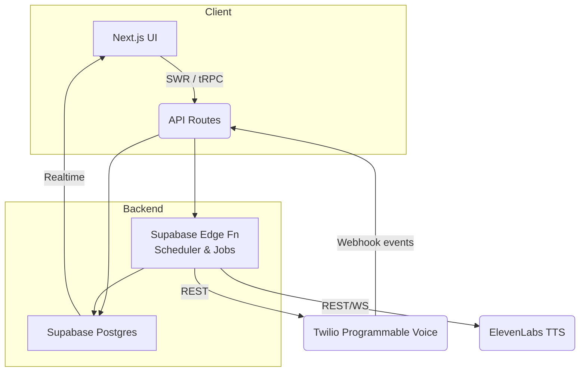

# Henk AI Documentation

## 1. Product Overview & Value Proposition

### What is Henk?

**Henk** is an AI‑powered voice fundraising platform that enables charities to engage donors through natural phone conversations at scale. By combining synthetic speech, CRM integration, and compliance‑centric design, Henk reduces operational costs while improving donor experience and conversion rates.

#### Core Benefits

- **24/7 Donor Outreach** – always‑on voice agents that call when donors are available across time zones.
- **Natural Conversations** – ElevenLabs neural TTS produces lifelike voices; knowledge base and tone settings adapt to each campaign.
- **Actionable Insights** – Real‑time analytics surface optimal call times, donor sentiment, and conversion metrics.
- **Plug‑and‑Play Integration** – Connects to existing CRMs in minutes; CSV import for rapid trials.
- **GDPR‑first** – Row‑level security, consent tracking, and automated data erasure workflows.
- **Lower Cost** – Minutes from Twilio plus a serverless stack cost a fraction of traditional call centers.

Ideal stakeholders: charity leadership, fundraising managers, potential investors, early engineering hires.

---

## 2. Quick‑Start (Local Development)

> Goal: run the full stack locally in ≤10 minutes.

1. **Clone & install**

   ```bash
   git clone git@github.com:callhenk/henk.git
   cd henk
   pnpm install
   ```

2. **Environment variables**

   Copy the template and fill in keys (ask a maintainer for dev secrets):

   ```bash
   cp .env.example .env.local
   ```

   | Variable             | Example                   | Notes                    |
   | -------------------- | ------------------------- | ------------------------ |
   | `SUPABASE_URL`       | `https://xyz.supabase.co` | Dev project URL          |
   | `SUPABASE_ANON_KEY`  | `ey...`                   | Supabase anon key        |
   | `TWILIO_ACCOUNT_SID` | `ACxxxxxxxx`              | Twilio dev account       |
   | `TWILIO_AUTH_TOKEN`  | `xxxxxxxx`                |                          |
   | `TWILIO_CALLER_ID`   | `+15551234567`            | Verified outgoing number |
   | `ELEVENLABS_API_KEY` | `e7xxxx`                  | Trial key                |

3. **Seed the database**

   ```bash
   pnpm supabase db reset --linked
   pnpm supabase db seed
   ```

4. **Run everything**

   ```bash
   pnpm dev     # Next.js + Supabase client + API routes
   ```

5. **Expose webhook endpoint**

   ```bash
   ngrok http 3000
   ```

   Copy the HTTPS forwarding URL and set it in Twilio Console → Programmable Voice → Webhook (`/api/twilio/webhook`).

6. **Create a test call** In the dashboard, add yourself as a donor, start a campaign, then click **Start Campaign**. Wait for Twilio to call your phone with the demo script.

**Troubleshooting**

- **401 Supabase**: verify `SUPABASE_ANON_KEY`.
- **Twilio 11200**: ngrok URL unreachable; restart ngrok and update Twilio webhook.
- **No audio**: check ElevenLabs quota or incorrect `voice_id`.

---

## 3. System Architecture (High‑Level)



### Narrative

1. **UI (Next.js)** fetches data via server actions and client hooks.
2. **API Routes** authenticate with Supabase JWT then read/write to Postgres.
3. **Edge Functions** act as workers (dial scheduler, CSV importer).
4. When a lead is due, the worker calls **Twilio** to start an outbound call.
5. Twilio requests a **TwiML** document from `/api/voice.xml`, which streams pre‑generated or live **ElevenLabs** audio.
6. Call status events → Webhook → Edge function → `calls` table → Supabase Realtime channel → KPI widgets in the dashboard.

Here is the updated tech stack description, simplified and now includes Twilio with the latest ElevenLabs integration clarification:

---

## 2 · Tech Stack & AI Tooling

| Layer                    | Primary Tech                                      | Notes                                                          |
| ------------------------ | ------------------------------------------------- | -------------------------------------------------------------- |
| **Frontend**             | **Next.js 14 (App Router) + TypeScript**          | Radix UI, Tailwind, React Query, SWR for data‑fetching         |
| **API / BFF**            | Next.js API Routes (Vercel Functions)             | tRPC for end‑to‑end typing                                     |
| **Database & Auth**      | **Supabase (Postgres 16 + RLS + Realtime)**       | Managed storage bucket for audio assets                        |
| **Job Workers & Cron**   | Supabase Edge Functions                           | Dial scheduler, CSV importer, nightly analytics roll‑ups       |
| **Voice & Conversation** | **ElevenLabs Conversational AI**                  | Handles voice generation, transcription, and conversation flow |
| **Telephony**            | **Twilio Programmable Voice + TwiML**             | Outbound dial, DTMF capture, webhook events                    |
| **Deployment**           | **Vercel**                                        | Serverless frontend + backend with preview deployments         |
| **Observability**        | Pino → Logtail, Vercel Analytics, Twilio Debugger | Slack alerts on spend & error thresholds                       |
| **Dev Tools**            | GitHub Copilot, Cursor AI                         | Code completion and refactoring                                |

> _Why this stack?_ It’s fully serverless, fast to develop with, and easy to scale. ElevenLabs powers natural conversations and transcription in real time, while Twilio handles calling. Supabase and Vercel keep everything simple, secure, and cost-efficient.
