# ElevenLabs Integration Architecture

## 🏗 Hybrid System Architecture Overview

> **Architecture Decision**: This implementation uses a **hybrid approach** combining Supabase Edge Functions for voice generation with a persistent Campaign Orchestrator service for complex campaign management.

```mermaid
graph TB
    %% Frontend Components
    subgraph "Frontend (React/Next.js)"
        A[Voice Test Component]
        B[Agent Form]
        C[Campaign Manager]
        D[Voice Selection UI]
        E[Campaign Detail]
        F[Real-time Dashboard]
    end

    %% Next.js API Routes
    subgraph "Next.js API Routes"
        G["/api/voice/test"]
        H["/api/voice/generate"]
        I["/api/voice/voices"]
        J["/api/agents"]
        K["/api/campaigns"]
        L["/api/campaigns/[id]/start"]
        M["/api/campaigns/[id]/status"]
        N["/api/twilio/webhook"]
    end

    %% Supabase Edge Functions
    subgraph "Supabase Edge Functions"
        O[elevenlabs/voices/index.ts]
        P[elevenlabs/generate/index.ts]
        Q[elevenlabs/voices/test.ts]
        R[audio/process/index.ts]
    end

    %% Campaign Orchestrator Service (EC2/Docker)
    subgraph "Campaign Orchestrator Service"
        S[Campaign Manager]
        T[Call Queue]
        U[Retry Logic Engine]
        V[Schedule Manager]
        W[Status Monitor]
        X[WebSocket Server]
    end

    %% External Services
    subgraph "External Services"
        Y[ElevenLabs API]
        Z[Twilio API]
        AA[Supabase Storage]
        BB[Supabase Database]
        CC[Redis Cache]
    end

    %% Data Flow - Frontend
    A --> G
    B --> J
    C --> K
    D --> I
    E --> M
    F --> X

    %% Data Flow - API Routes
    G --> Q
    H --> P
    I --> O
    L --> S
    M --> W
    N --> W

    %% Data Flow - Edge Functions
    Q --> Y
    P --> Y
    O --> Y
    P --> AA
    Q --> AA

    %% Data Flow - Campaign Orchestrator
    S --> T
    T --> U
    U --> V
    V --> Z
    T --> P
    W --> BB
    X --> F

    %% Data Flow - External
    Z --> N
    S --> BB
    T --> CC
    W --> CC

    %% Styling
    classDef frontend fill:#e3f2fd
    classDef api fill:#f3e5f5
    classDef edge fill:#fff3e0
    classDef orchestrator fill:#e8f5e8
    classDef external fill:#ffebee

    class A,B,C,D,E,F frontend
    class G,H,I,J,K,L,M,N api
    class O,P,Q,R edge
    class S,T,U,V,W,X orchestrator
    class Y,Z,AA,BB,CC external
```

## 🔄 Detailed Flow Diagrams

### **Voice Testing Flow**

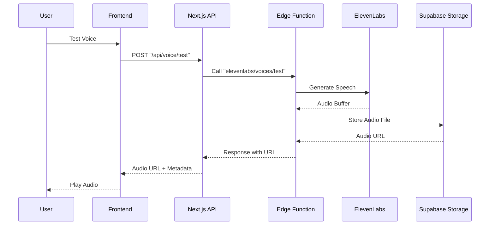

### **Campaign Start Flow**

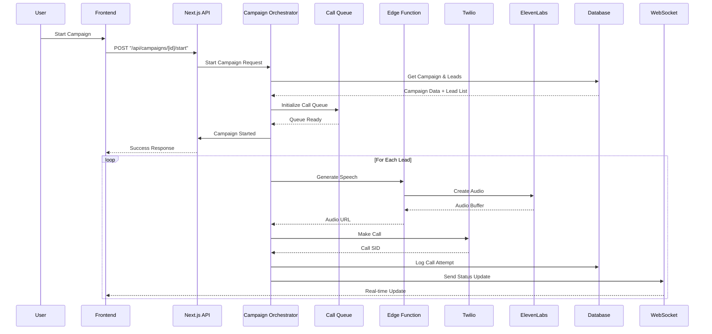

### **Call Execution Flow**

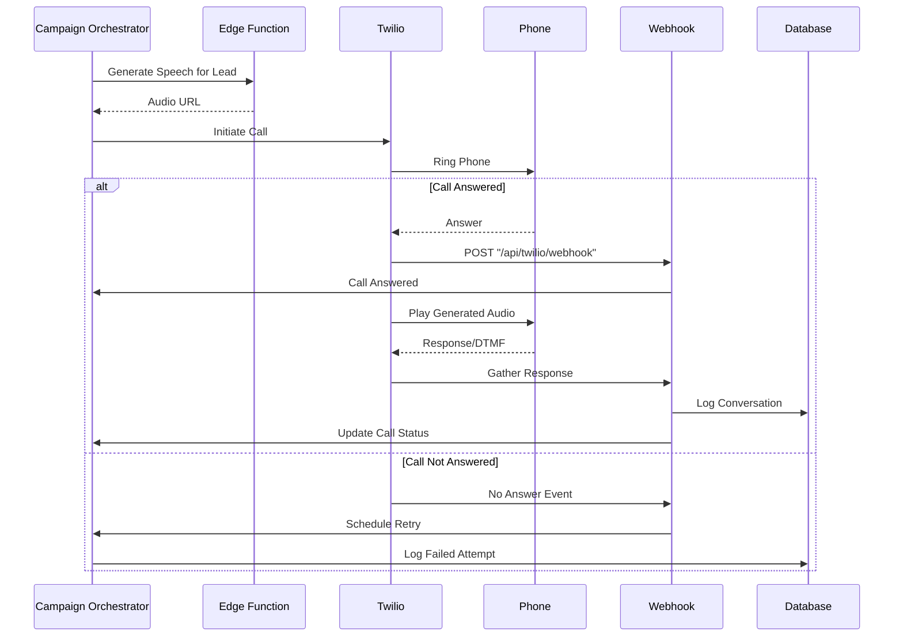

## 🏗 Component Architecture

### **Edge Functions Layer**

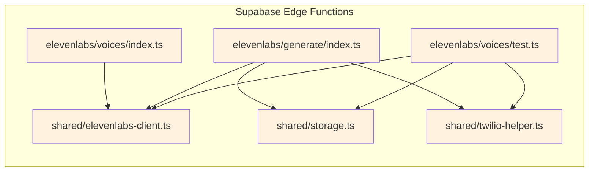

### **Campaign Orchestrator Layer**

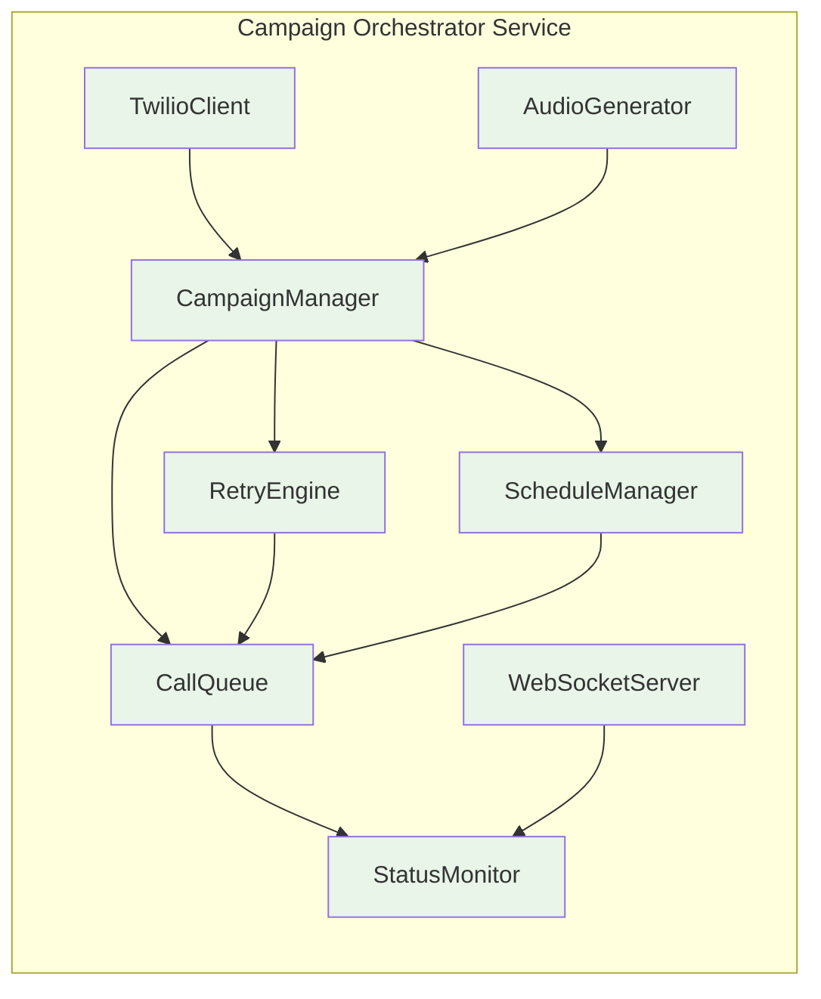

### **Frontend Layer**

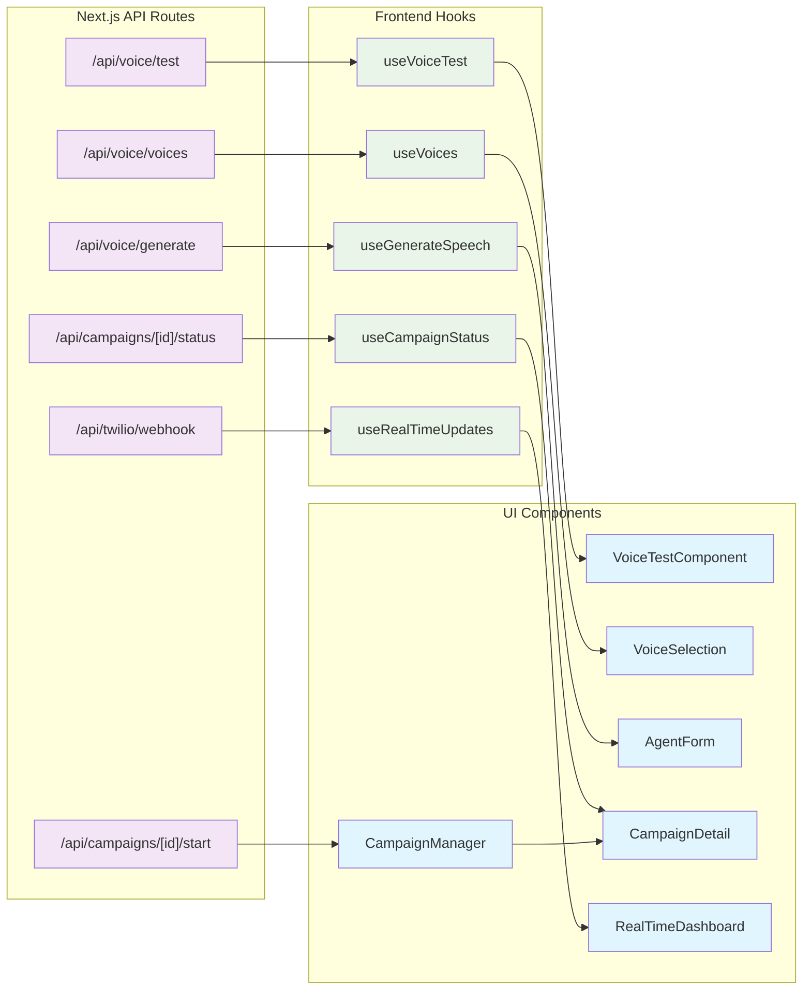

## 📊 Data Flow Architecture

### **Voice Testing Flow**

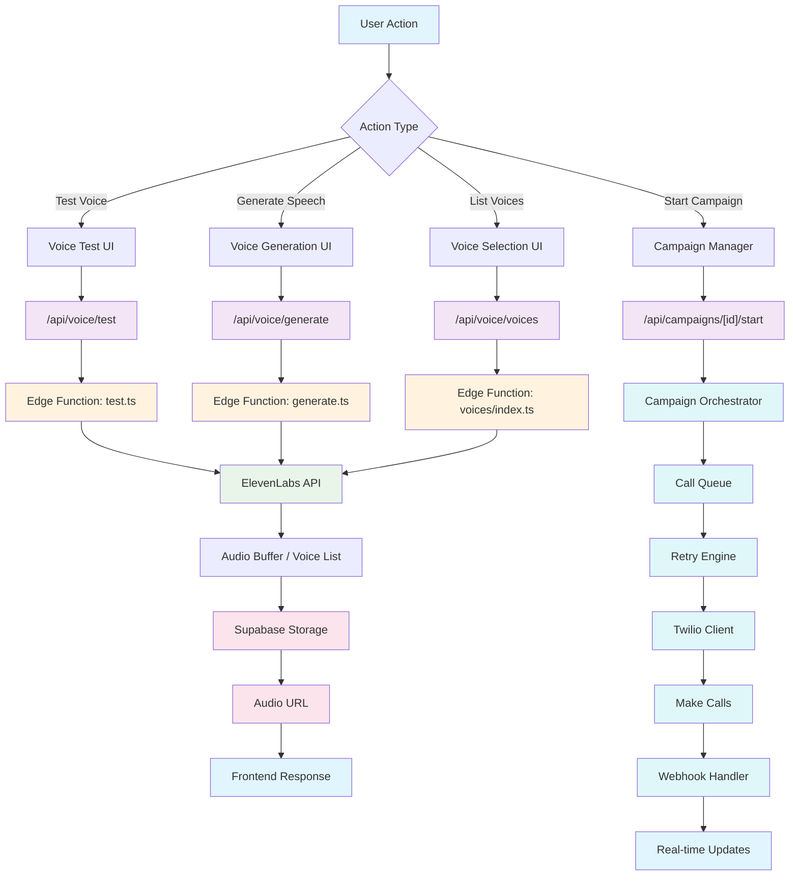

### **Campaign Execution Architecture**

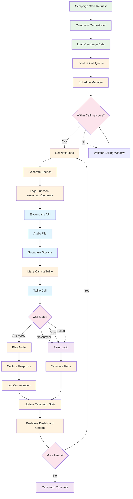

## 🔧 Implementation Phases

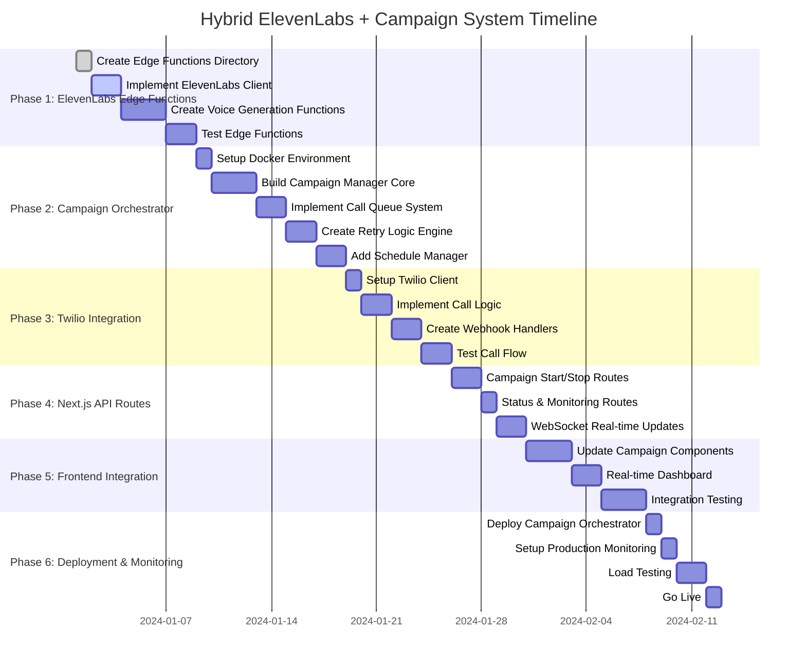

## 🎯 Key Benefits

### **Hybrid Architecture Benefits:**

#### **Edge Functions (Supabase) - Voice Generation:**

- **Performance**: Global distribution, sub-100ms voice generation
- **Security**: ElevenLabs API keys isolated in secure environment
- **Scalability**: Auto-scaling for voice synthesis requests
- **Cost Efficiency**: Pay-per-use for voice generation only
- **Reliability**: Built-in error handling and retries

#### **Campaign Orchestrator (EC2/Docker) - Campaign Management:**

- **Persistent State**: Maintains campaign progress across thousands of calls
- **Complex Scheduling**: Handles calling hours, daily caps, retry logic
- **Call Queue Management**: Efficient processing of large lead lists
- **Real-time Monitoring**: WebSocket connections for live updates
- **Cost Predictability**: Fixed cost regardless of campaign size

#### **Next.js API Routes - User Interface:**

- **Seamless Integration**: Direct frontend-to-backend communication
- **Authentication**: Secure user context and permissions
- **Database Access**: Direct Supabase client integration
- **Type Safety**: Full TypeScript support throughout
- **Developer Experience**: Easy debugging and testing

### **Architecture Decision Rationale:**

| Component                  | Why Not Edge Functions Alone?                | Why Hybrid Approach? |
| -------------------------- | -------------------------------------------- | -------------------- |
| **Voice Generation**       | ✅ Perfect fit - stateless, fast             | Use Edge Functions   |
| **Campaign Orchestration** | ❌ Need persistent state, complex scheduling | Use EC2 Service      |
| **Call Management**        | ❌ Long-running processes, queue management  | Use EC2 Service      |
| **Real-time Updates**      | ❌ WebSocket connections not supported       | Use EC2 + WebSockets |
| **User APIs**              | ✅ Great for CRUD operations                 | Use Next.js Routes   |

## 🚀 Implementation Details

### **Required Infrastructure:**

```yaml
# Infrastructure Requirements
Edge Functions (Supabase):
  - elevenlabs/voices/index.ts
  - elevenlabs/generate/index.ts
  - elevenlabs/voices/test.ts
  - shared/elevenlabs-client.ts

Campaign Orchestrator (EC2 t3.medium):
  - Docker container
  - Redis for queue management
  - WebSocket server for real-time updates
  - Persistent storage for campaign state

Next.js Application:
  - API routes for user-facing operations
  - Real-time dashboard components
  - Campaign management interface
```

### **Environment Variables:**

```bash
# ElevenLabs Integration
ELEVENLABS_API_KEY=your_elevenlabs_key
ELEVENLABS_VOICE_ID=default_voice_id

# Twilio Configuration
TWILIO_ACCOUNT_SID=your_twilio_sid
TWILIO_AUTH_TOKEN=your_twilio_token
TWILIO_CALLER_ID=your_twilio_number

# Campaign Orchestrator
ORCHESTRATOR_URL=https://your-ec2-instance.com
ORCHESTRATOR_API_KEY=your_orchestrator_key
REDIS_URL=redis://your-redis-instance:6379

# Webhook URLs
WEBHOOK_BASE_URL=https://your-app.vercel.app
```

### **Deployment Strategy:**

1. **Phase 1**: Deploy Edge Functions for voice testing
2. **Phase 2**: Setup EC2 instance with Campaign Orchestrator
3. **Phase 3**: Update Next.js API routes to communicate with orchestrator
4. **Phase 4**: Deploy frontend updates with real-time dashboard
5. **Phase 5**: Production testing and monitoring setup

This hybrid architecture provides optimal performance, cost efficiency, and maintainability by using each technology for its strengths while avoiding their limitations.

## 📊 Architecture Comparison

### **Before: Edge Functions Only**

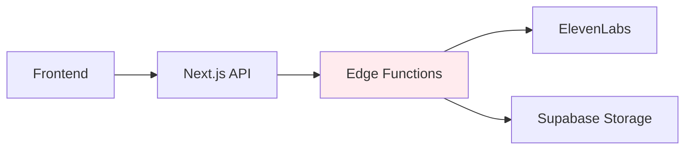

**Limitations:**

- ❌ No persistent state for campaigns
- ❌ Cannot handle complex scheduling logic
- ❌ No real-time monitoring capabilities
- ❌ Expensive for long-running processes
- ❌ No call queue management

### **After: Hybrid Architecture**

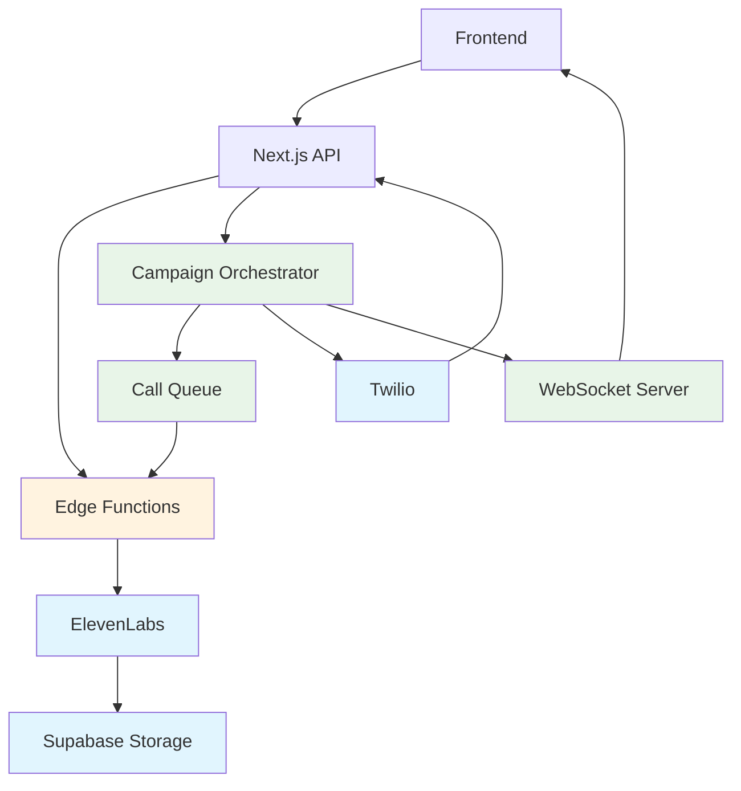

**Capabilities:**

- ✅ Persistent campaign state management
- ✅ Complex scheduling and retry logic
- ✅ Real-time monitoring and updates
- ✅ Cost-efficient call processing
- ✅ Scalable call queue management
- ✅ Full telephony integration
- ✅ Production-ready monitoring

## 🎯 Next Steps

1. **Start with Edge Functions**: Implement voice generation first
2. **Build Campaign Orchestrator**: Create the EC2 service for campaign management
3. **Integrate Twilio**: Add calling capabilities
4. **Frontend Updates**: Build real-time dashboard
5. **Production Deployment**: Deploy and monitor the complete system

This updated architecture addresses all the limitations identified in the original Edge Functions-only approach while maintaining the benefits of serverless voice generation.
