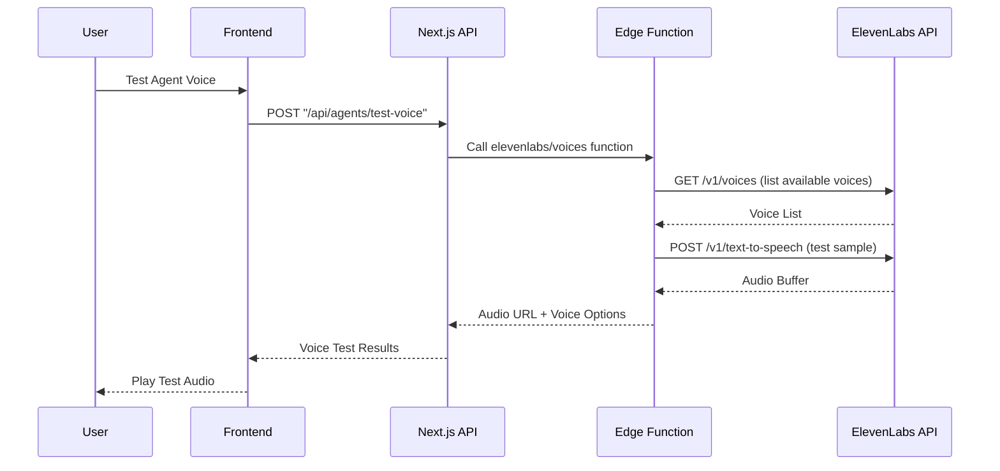
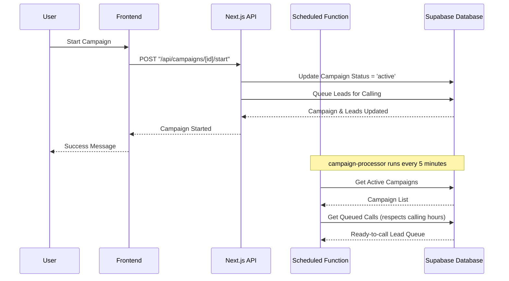
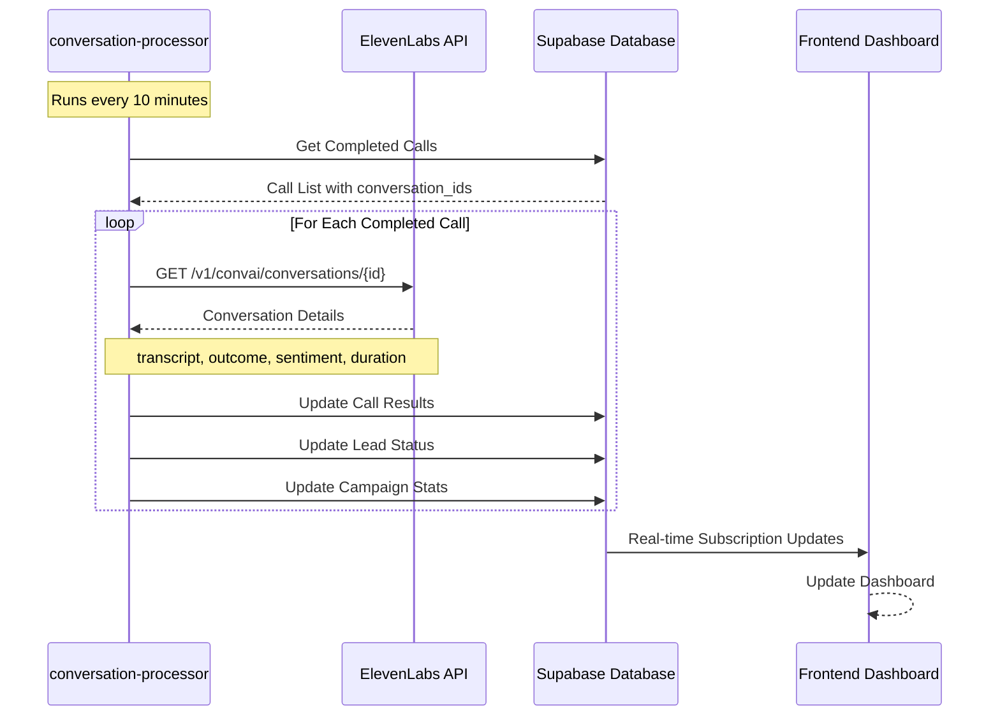
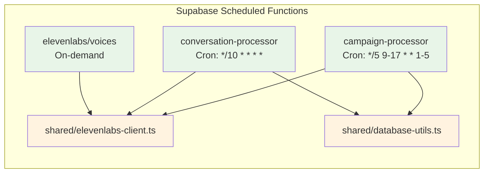
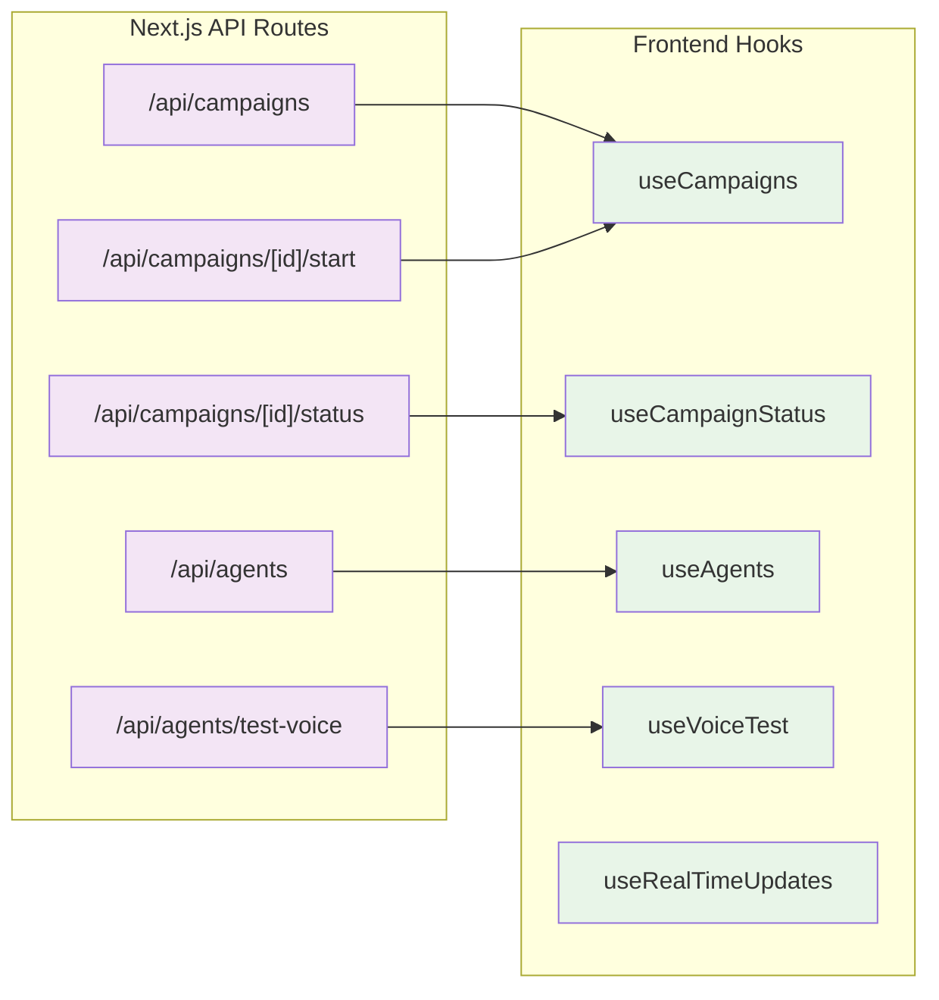
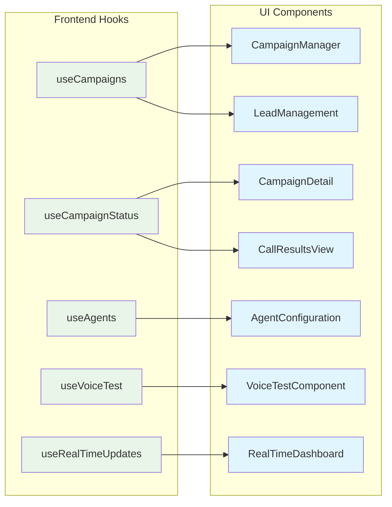
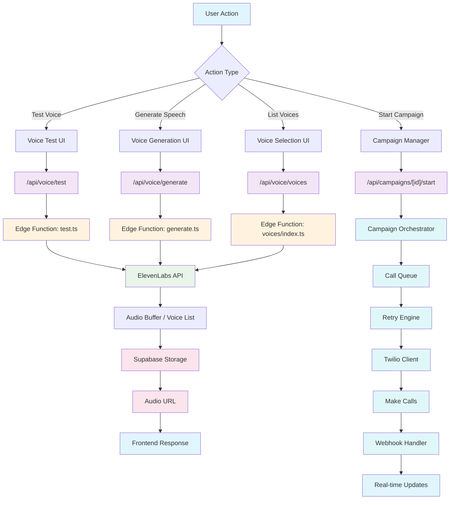
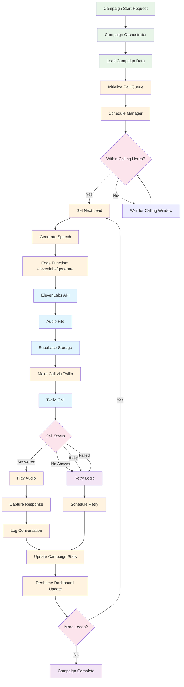
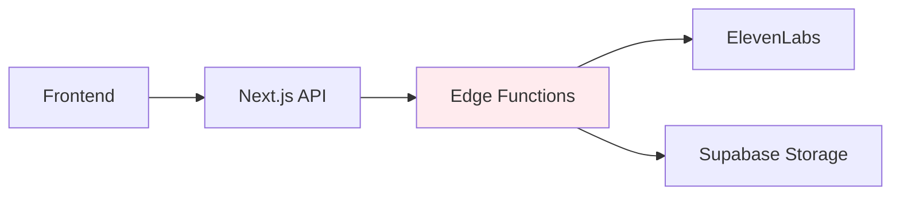
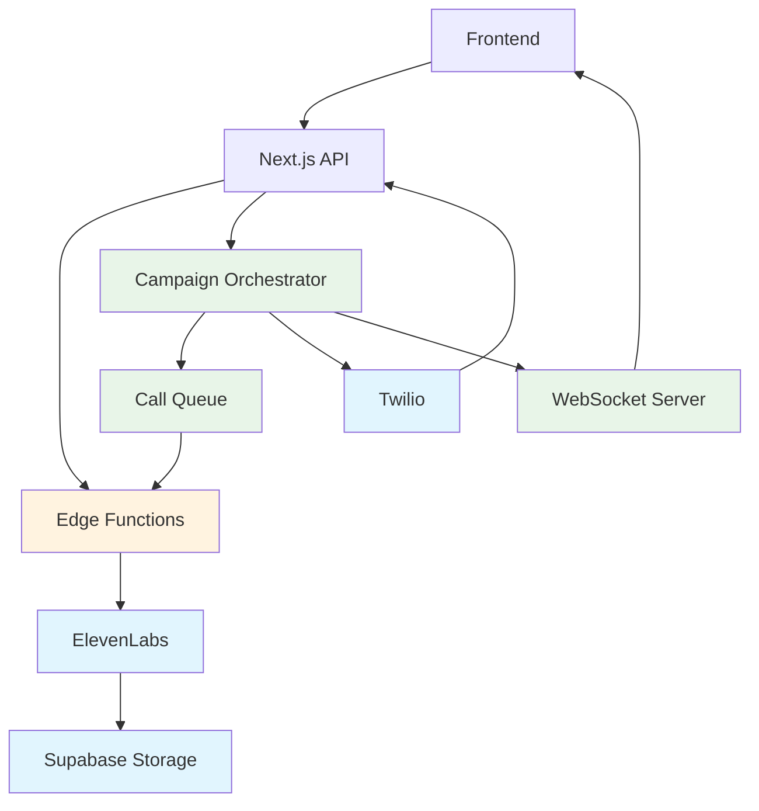

# ElevenLabs Integration Architecture

## 🏗 Simplified Outbound Campaign Architecture

> **Architecture Decision**: This implementation uses **Supabase Scheduled Functions** with the **ElevenLabs Outbound Call API** for maximum simplicity and cost-effectiveness. No persistent servers or WebSocket management required.

```mermaid
graph TB
    %% Frontend Components
    subgraph "Frontend (React/Next.js)"
        A[Campaign Manager]
        B[Campaign Detail]
        C[Real-time Dashboard]
        D[Agent Configuration]
    end

    %% Next.js API Routes
    subgraph "Next.js API Routes"
        E["/api/campaigns"]
        F["/api/campaigns/[id]/start"]
        G["/api/campaigns/[id]/status"]
        H["/api/agents"]
    end

    %% Supabase Scheduled Functions
    subgraph "Supabase Scheduled Functions"
        I[campaign-processor<br/>Every 5 min]
        J[conversation-processor<br/>Every 10 min]
        K[elevenlabs/voices<br/>On-demand]
    end

    %% External Services
    subgraph "External Services"
        L[ElevenLabs Outbound API]
        M[ElevenLabs Conversations API]
        N[Twilio (via ElevenLabs)]
        O[Supabase Database]
    end

    %% Data Flow - Frontend
    A --> E
    B --> G
    C --> G
    D --> H

    %% Data Flow - API Routes
    F --> I
    E --> O
    G --> O
    H --> O

    %% Data Flow - Scheduled Functions
    I --> L
    I --> O
    J --> M
    J --> O
    K --> L

    %% Data Flow - External
    L --> N
    M --> O

    %% Styling
    classDef frontend fill:#e3f2fd
    classDef api fill:#f3e5f5
    classDef scheduled fill:#e8f5e8
    classDef external fill:#ffebee

    class A,B,C,D frontend
    class E,F,G,H api
    class I,J,K scheduled
    class L,M,N,O external
```

## 🔄 Detailed Flow Diagrams

### **Agent Voice Testing Flow**



### **Campaign Start Flow**



### **Outbound Call Processing Flow**


### **Conversation Results Processing Flow**



## 🏗 Component Architecture

### **Scheduled Functions Layer**



### **API Routes Layer**



### **Frontend Components Layer**



## 📊 Simplified Data Flow Architecture

### **Voice Testing Flow**



### **Campaign Execution Architecture**



## 🔧 Implementation Phases

```mermaid
gantt
    title Simplified ElevenLabs Outbound Campaign System
    dateFormat  YYYY-MM-DD

    section Phase 1: Scheduled Functions
    Setup ElevenLabs API Integration    :done, p1, 2024-01-01, 1d
    Create campaign-processor Function  :active, p2, 2024-01-02, 2d
    Create conversation-processor       :p3, 2024-01-04, 2d
    Test Basic Outbound Calls          :p4, 2024-01-06, 1d

    section Phase 2: Database Integration
    Update Migration for Call Tracking :p5, 2024-01-07, 1d
    Implement Database Helper Functions :p6, 2024-01-08, 1d
    Add Call Results Processing        :p7, 2024-01-09, 1d

    section Phase 3: Frontend Integration
    Update Campaign Start Logic        :p8, 2024-01-10, 1d
    Real-time Dashboard Updates        :p9, 2024-01-11, 2d
    Call Results Display               :p10, 2024-01-13, 1d

    section Phase 4: Production Deploy
    Deploy Scheduled Functions         :p11, 2024-01-14, 1d
    Setup Environment Variables        :p12, 2024-01-15, 1d
    Production Testing                 :p13, 2024-01-16, 2d
    Go Live                           :p14, 2024-01-18, 1d
```

## 🎯 Key Benefits

### **Hybrid Architecture Benefits:**

#### **Edge Functions (Supabase) - Voice Generation:**

- **Performance**: Global distribution, sub-100ms voice generation
- **Security**: ElevenLabs API keys isolated in secure environment
- **Scalability**: Auto-scaling for voice synthesis requests
- **Cost Efficiency**: Pay-per-use for voice generation only
- **Reliability**: Built-in error handling and retries

#### **Campaign Orchestrator (EC2/Docker) - Campaign Management:**

- **Persistent State**: Maintains campaign progress across thousands of calls
- **Complex Scheduling**: Handles calling hours, daily caps, retry logic
- **Call Queue Management**: Efficient processing of large lead lists
- **Real-time Monitoring**: WebSocket connections for live updates
- **Cost Predictability**: Fixed cost regardless of campaign size

#### **Next.js API Routes - User Interface:**

- **Seamless Integration**: Direct frontend-to-backend communication
- **Authentication**: Secure user context and permissions
- **Database Access**: Direct Supabase client integration
- **Type Safety**: Full TypeScript support throughout
- **Developer Experience**: Easy debugging and testing

### **Architecture Decision Rationale:**

| Component                  | Why Not Edge Functions Alone?                | Why Hybrid Approach? |
| -------------------------- | -------------------------------------------- | -------------------- |
| **Voice Generation**       | ✅ Perfect fit - stateless, fast             | Use Edge Functions   |
| **Campaign Orchestration** | ❌ Need persistent state, complex scheduling | Use EC2 Service      |
| **Call Management**        | ❌ Long-running processes, queue management  | Use EC2 Service      |
| **Real-time Updates**      | ❌ WebSocket connections not supported       | Use EC2 + WebSockets |
| **User APIs**              | ✅ Great for CRUD operations                 | Use Next.js Routes   |

## 🚀 Implementation Details

### **Required Infrastructure:**

```yaml
# Infrastructure Requirements
Edge Functions (Supabase):
  - elevenlabs/voices/index.ts
  - elevenlabs/generate/index.ts
  - elevenlabs/voices/test.ts
  - shared/elevenlabs-client.ts

Campaign Orchestrator (EC2 t3.medium):
  - Docker container
  - Redis for queue management
  - WebSocket server for real-time updates
  - Persistent storage for campaign state

Next.js Application:
  - API routes for user-facing operations
  - Real-time dashboard components
  - Campaign management interface
```

### **Environment Variables:**

```bash
# ElevenLabs Integration
ELEVENLABS_API_KEY=your_elevenlabs_key
ELEVENLABS_VOICE_ID=default_voice_id

# Twilio Configuration
TWILIO_ACCOUNT_SID=your_twilio_sid
TWILIO_AUTH_TOKEN=your_twilio_token
TWILIO_CALLER_ID=your_twilio_number

# Campaign Orchestrator
ORCHESTRATOR_URL=https://your-ec2-instance.com
ORCHESTRATOR_API_KEY=your_orchestrator_key
REDIS_URL=redis://your-redis-instance:6379

# Webhook URLs
WEBHOOK_BASE_URL=https://your-app.vercel.app
```

### **Deployment Strategy:**

1. **Phase 1**: Deploy Edge Functions for voice testing
2. **Phase 2**: Setup EC2 instance with Campaign Orchestrator
3. **Phase 3**: Update Next.js API routes to communicate with orchestrator
4. **Phase 4**: Deploy frontend updates with real-time dashboard
5. **Phase 5**: Production testing and monitoring setup

This hybrid architecture provides optimal performance, cost efficiency, and maintainability by using each technology for its strengths while avoiding their limitations.

## 📊 Architecture Comparison

### **Before: Edge Functions Only**



**Limitations:**

- ❌ No persistent state for campaigns
- ❌ Cannot handle complex scheduling logic
- ❌ No real-time monitoring capabilities
- ❌ Expensive for long-running processes
- ❌ No call queue management

### **After: Hybrid Architecture**



**Capabilities:**

- ✅ Outbound conversational AI campaigns
- ✅ Real-time call processing via ElevenLabs
- ✅ Scheduled batch processing (5-minute intervals)
- ✅ Automatic conversation analysis and results processing
- ✅ Cost-effective scaling with zero infrastructure management
- ✅ Built-in retry logic and error handling
- ✅ Real-time dashboard updates via database subscriptions

## 🚀 Implementation Details

### **Required Components:**

```yaml
# Supabase Scheduled Functions
functions/campaign-processor:
  schedule: '*/5 9-17 * * 1-5' # Every 5 min during business hours
  purpose: Process queued calls via ElevenLabs API

functions/conversation-processor:
  schedule: '*/10 * * * *' # Every 10 minutes
  purpose: Fetch completed conversation results

functions/elevenlabs/voices:
  trigger: 'on-demand' # For agent voice testing
  purpose: List and test available voices
```

### **Environment Variables:**

```bash
# ElevenLabs Integration
ELEVENLABS_API_KEY=your_elevenlabs_api_key
ELEVENLABS_AGENT_ID=your_default_agent_id

# Supabase Integration
SUPABASE_URL=your_supabase_project_url
SUPABASE_SERVICE_ROLE_KEY=your_service_role_key

# Optional: Webhook endpoint for real-time updates
WEBHOOK_BASE_URL=https://your-app.vercel.app
```

### **Deployment Commands:**

```bash
# Deploy scheduled functions
supabase functions deploy campaign-processor --schedule "*/5 9-17 * * 1-5"
supabase functions deploy conversation-processor --schedule "*/10 * * * *"
supabase functions deploy elevenlabs/voices

# Set secrets
supabase secrets set ELEVENLABS_API_KEY=your_key
supabase secrets set ELEVENLABS_AGENT_ID=your_agent_id
```

## 🎯 Next Steps

1. **Deploy Database Migration**: Apply the campaign orchestrator schema
2. **Create Scheduled Functions**: Implement campaign and conversation processors
3. **Update Frontend**: Add campaign start/stop functionality
4. **Test with ElevenLabs**: Configure agents and test outbound calls
5. **Production Launch**: Deploy and monitor live campaigns

This simplified architecture leverages ElevenLabs' powerful outbound calling capabilities while maintaining the benefits of serverless functions - dramatically reducing complexity while providing enterprise-grade conversational AI for fundraising campaigns.
