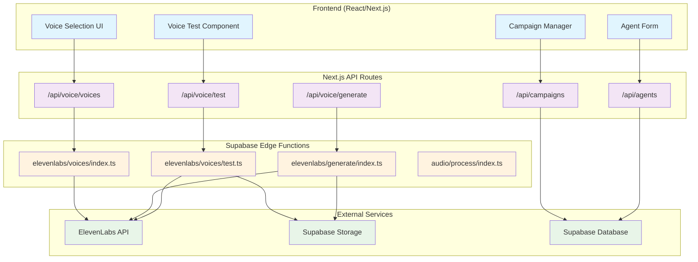
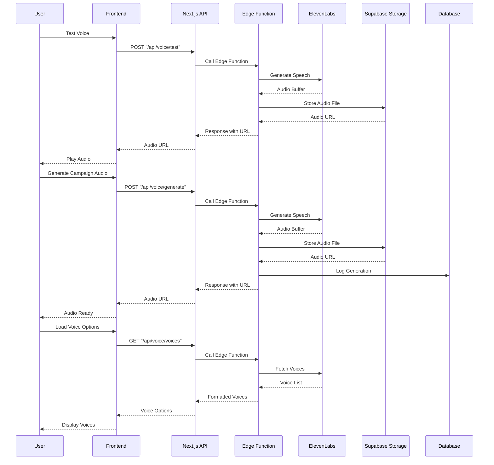
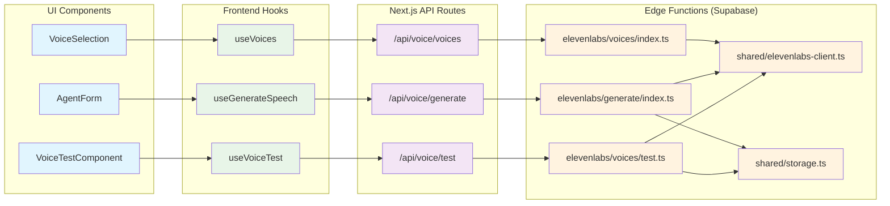
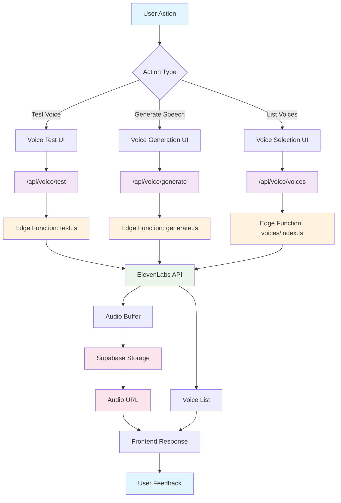
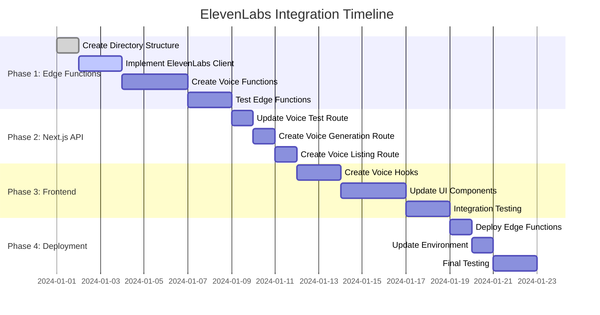

# ElevenLabs Integration Architecture

## 🏗 System Architecture Overview

## 🔄 Detailed Flow Diagram

## 🏗 Component Architecture

## 📊 Data Flow Architecture

## 🔧 Implementation Phases

## 🎯 Key Benefits

### **Edge Functions Benefits:**

- **Performance**: Global distribution, faster response times
- **Security**: API keys isolated in Supabase environment
- **Scalability**: Automatic scaling per request
- **Cost**: Pay-per-use pricing
- **Reliability**: Built-in error handling and retries

### **Next.js API Routes Benefits:**

- **Integration**: Seamless with existing frontend
- **Authentication**: Easy access to user context
- **Database**: Direct access to Supabase client
- **Type Safety**: Full TypeScript support
- **Development**: Easier debugging and testing

This architecture provides the best of both worlds: high-performance edge functions for external API calls and heavy processing, while maintaining the flexibility and integration capabilities of Next.js API routes for user-facing operations.
