# ElevenLabs Integration Architecture

## 🏗 Simplified Outbound Campaign Architecture

> **Architecture Decision**: This implementation uses **Supabase Scheduled Functions** with the **ElevenLabs Outbound Call API** for maximum simplicity and cost-effectiveness. No persistent servers or WebSocket management required.

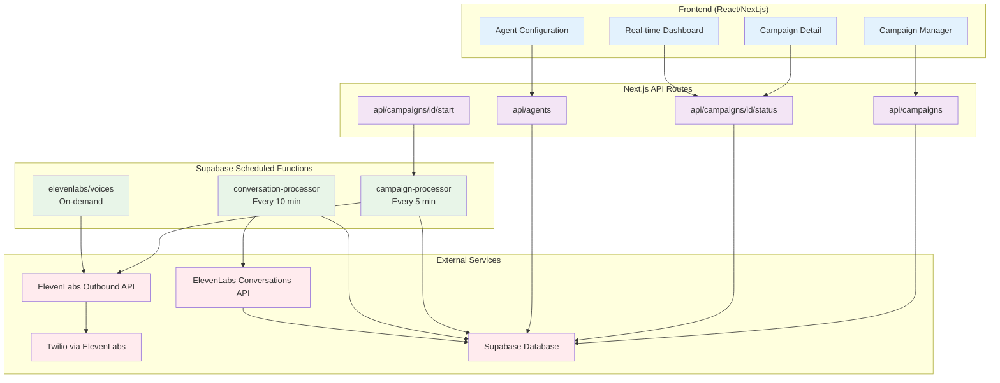

## 🔄 Detailed Flow Diagrams

### **Agent Voice Testing Flow**

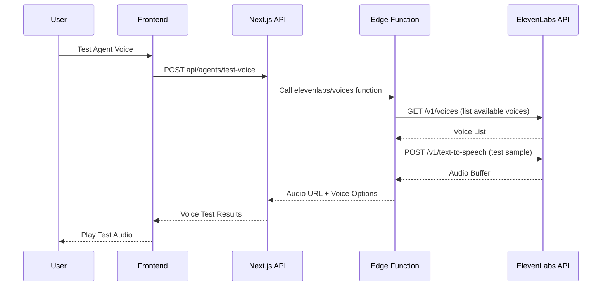

### **Campaign Start Flow**

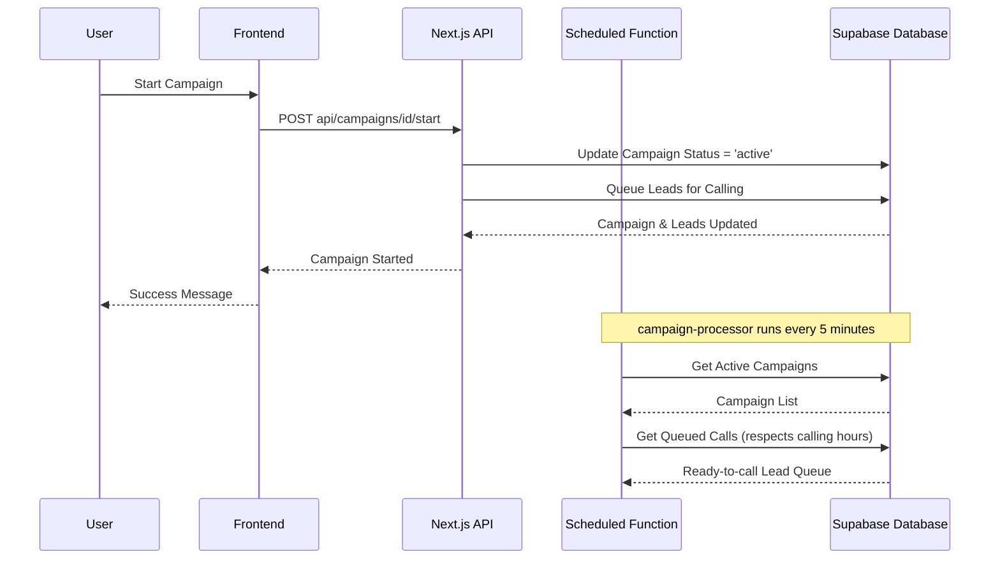

### **Outbound Call Processing Flow**

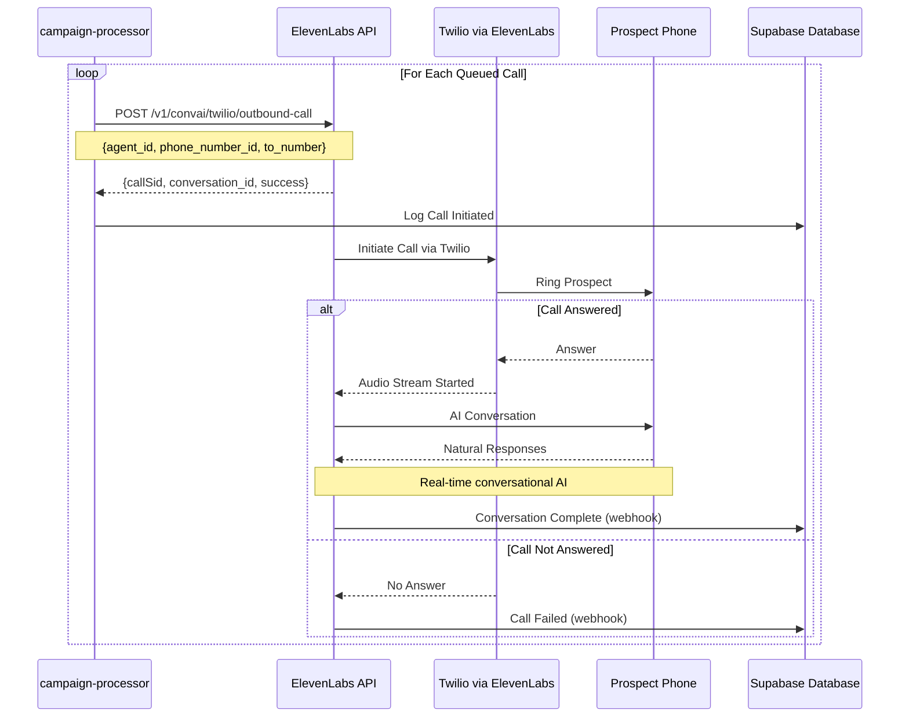

### **Conversation Results Processing Flow**

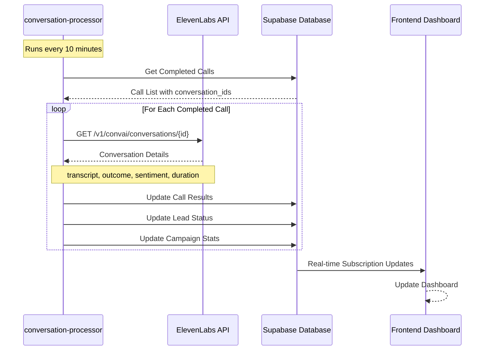

## 🏗 Component Architecture

### **Scheduled Functions Layer**

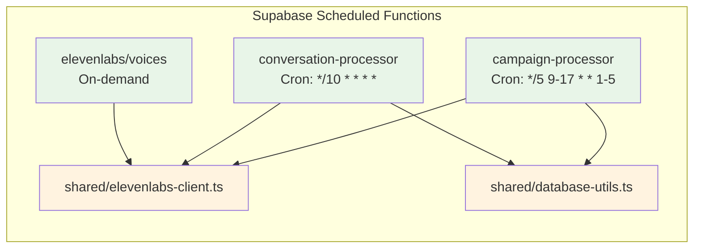

### **API Routes Layer**

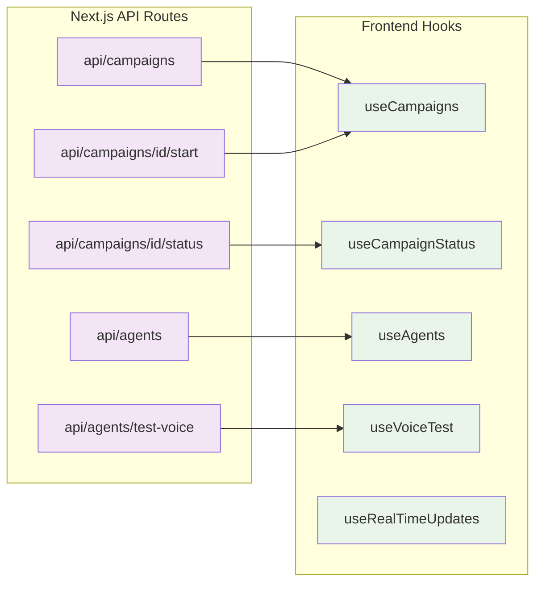

### **Frontend Components Layer**

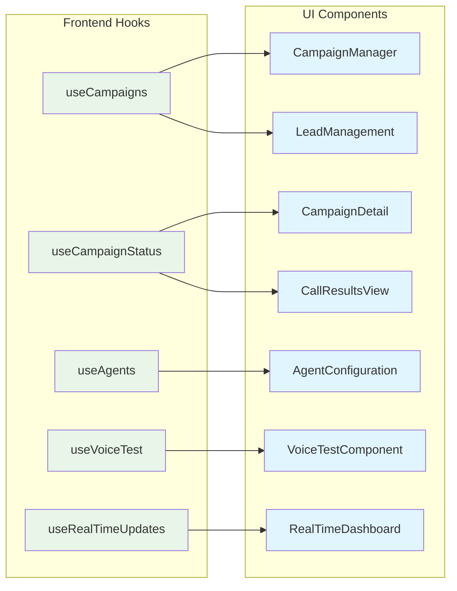

## 📊 Simplified Data Flow Architecture

### **Campaign Processing Flow**

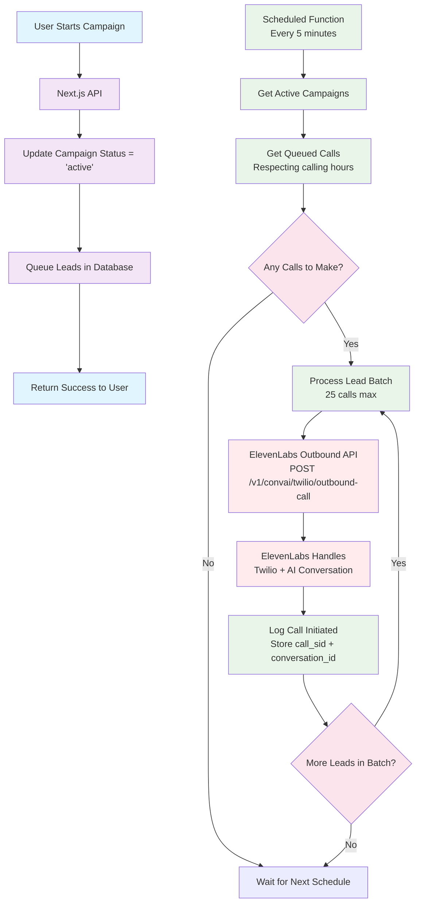

### **Results Processing Flow**

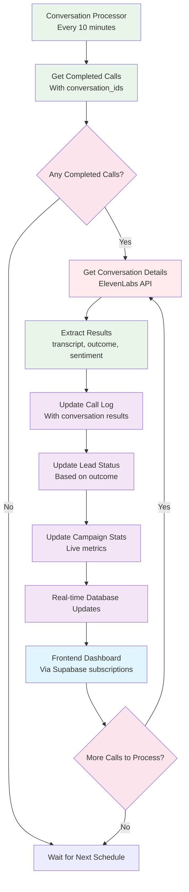

## 🔧 Implementation Phases

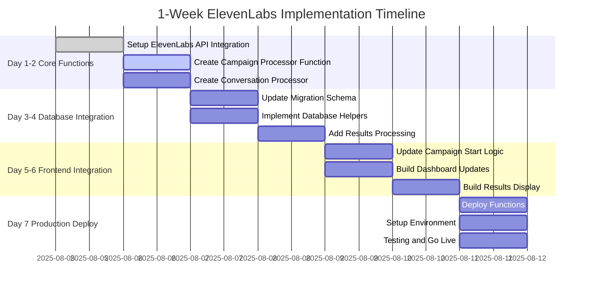

## 🎯 Key Benefits

### **Simplified Architecture Benefits:**

#### **✅ Dramatically Reduced Complexity:**

- **No Infrastructure Management**: No servers, Docker, or WebSockets to manage
- **No Persistent State**: ElevenLabs handles all call state and conversation management
- **Single Deployment**: Just deploy Supabase Scheduled Functions
- **Built-in Reliability**: Automatic retries and error handling

#### **✅ Cost-Effective Scaling:**

- **Pay-per-Use**: Only pay when campaigns are running
- **No Fixed Costs**: No EC2 instances running 24/7
- **Efficient Resource Usage**: Functions sleep between scheduled runs
- **Predictable Pricing**: Know exactly what each call costs

#### **✅ ElevenLabs Handles the Heavy Lifting:**

- **Real-time Conversations**: Advanced conversational AI without WebSocket complexity
- **Twilio Integration**: ElevenLabs manages Twilio calls directly
- **Audio Processing**: No need to handle audio streams or buffering
- **Call Analytics**: Built-in conversation analysis and transcription

#### **✅ Perfect for MVP:**

- **Faster Development**: Deploy in 1 week, not months
- **Lower Risk**: Minimal infrastructure complexity
- **Easy Testing**: Test individual functions independently
- **Natural Scaling**: Automatically handles campaign growth

### **Architecture Comparison:**

| Aspect           | Simplified (Scheduled Functions) | Complex (Persistent Server) |
| ---------------- | -------------------------------- | --------------------------- |
| **Setup Time**   | ⭐⭐⭐⭐⭐ 1 week                | ⭐⭐ 2-3 weeks              |
| **Complexity**   | ⭐⭐ Very Simple                 | ⭐⭐⭐⭐⭐ Very Complex     |
| **Monthly Cost** | ⭐⭐⭐⭐⭐ $5-50                 | ⭐⭐ $100-500               |
| **Reliability**  | ⭐⭐⭐⭐⭐ Built-in              | ⭐⭐⭐ Custom setup         |
| **Scaling**      | ⭐⭐⭐⭐ Automatic               | ⭐⭐⭐ Manual               |
| **Maintenance**  | ⭐⭐⭐⭐⭐ Zero                  | ⭐⭐ High                   |

## 🚀 Implementation Details

### **Required Components:**

```yaml
# Supabase Scheduled Functions
functions/campaign-processor:
  schedule: '*/5 9-17 * * 1-5' # Every 5 min during business hours
  purpose: Process queued calls via ElevenLabs API

functions/conversation-processor:
  schedule: '*/10 * * * *' # Every 10 minutes
  purpose: Fetch completed conversation results

functions/elevenlabs/voices:
  trigger: 'on-demand' # For agent voice testing
  purpose: List and test available voices
```

### **Environment Variables:**

```bash
# ElevenLabs Integration
ELEVENLABS_API_KEY=your_elevenlabs_api_key
ELEVENLABS_AGENT_ID=your_default_agent_id

# Supabase Integration
SUPABASE_URL=your_supabase_project_url
SUPABASE_SERVICE_ROLE_KEY=your_service_role_key

# Optional: Webhook endpoint for real-time updates
WEBHOOK_BASE_URL=https://your-app.vercel.app
```

### **Deployment Commands:**

```bash
# Deploy scheduled functions
supabase functions deploy campaign-processor --schedule "*/5 9-17 * * 1-5"
supabase functions deploy conversation-processor --schedule "*/10 * * * *"
supabase functions deploy elevenlabs/voices

# Set secrets
supabase secrets set ELEVENLABS_API_KEY=your_key
supabase secrets set ELEVENLABS_AGENT_ID=your_agent_id
```

## 🎯 Next Steps

1. **Deploy Database Migration**: Apply the campaign management schema
2. **Create Scheduled Functions**: Implement campaign and conversation processors
3. **Update Frontend**: Add campaign start/stop functionality
4. **Test with ElevenLabs**: Configure agents and test outbound calls
5. **Production Launch**: Deploy and monitor live campaigns

This simplified architecture leverages ElevenLabs' powerful outbound calling capabilities while maintaining the benefits of serverless functions - dramatically reducing complexity while providing enterprise-grade conversational AI for fundraising campaigns. **Implementation can be completed in just 1 week**, making it perfect for rapid MVP deployment.
