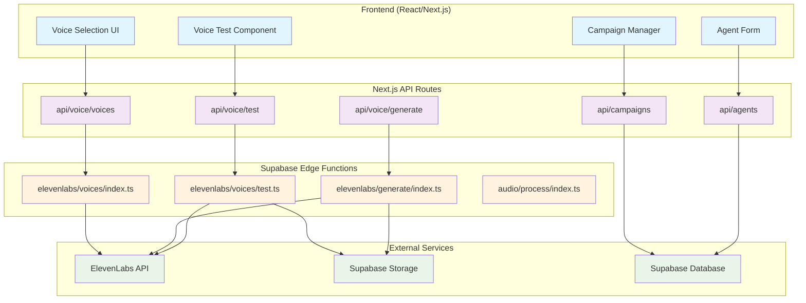
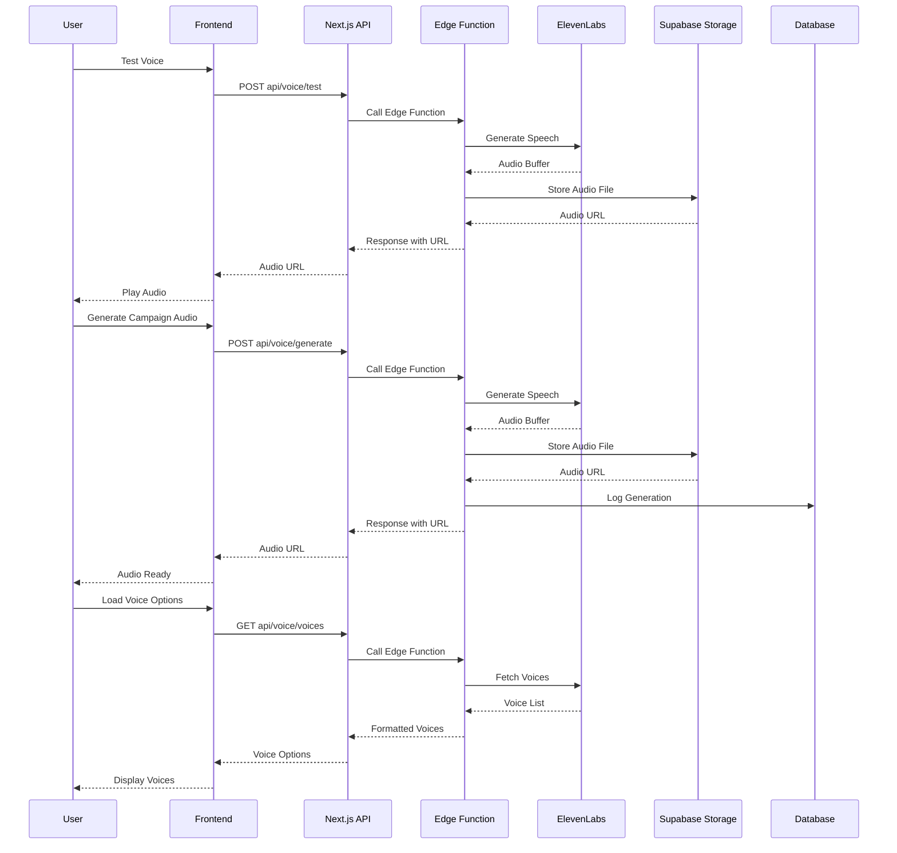

# ElevenLabs Integration Plan

## 🎯 Overview

This document outlines the comprehensive plan for integrating ElevenLabs voice synthesis into the Henk platform using Supabase Edge Functions. The integration will enable AI-powered voice agents for fundraising calls with natural speech synthesis.

## 🏗 Architecture Overview



## 🔄 Detailed Flow Diagram



## 🏗 Architecture Decision: Edge Functions vs Next.js Backend

### **✅ Edge Functions Should Handle:**

#### **1. ElevenLabs Direct API Integration**

```typescript
// Edge Functions - Direct external API calls
- /functions/elevenlabs/voices/index.ts     // List ElevenLabs voices
- /functions/elevenlabs/generate/index.ts   // Generate speech
- /functions/elevenlabs/voices/test.ts      // Test voice generation
```

**Why Edge Functions:**

- **Direct API Access**: No need to proxy through Next.js
- **Global Distribution**: Faster response times worldwide
- **Security**: API keys stay in Supabase environment
- **Scalability**: Automatic scaling per request

#### **2. Heavy Processing Tasks**

```typescript
// Edge Functions - CPU-intensive operations
- /functions/audio/process/index.ts          // Audio processing
- /functions/csv/import/index.ts             // Large CSV imports
- /functions/analytics/aggregate/index.ts    // Data aggregation
```

#### **3. Background Jobs**

```typescript
// Edge Functions - Long-running tasks
- /functions/campaigns/dialer/index.ts       // Campaign dialing
- /functions/notifications/send/index.ts     // Bulk notifications
- /functions/reports/generate/index.ts       // Report generation
```

### **✅ Next.js Backend Should Handle:**

#### **1. User-Facing API Routes**

```typescript
// Next.js API Routes - User interactions
- /api/agents/                              // CRUD operations
- /api/campaigns/                           // Campaign management
- /api/voice/test/                          // Voice testing (proxy to edge)
- /api/settings/                            // User settings
```

#### **2. Authentication & Authorization**

```typescript
// Next.js API Routes - Auth-dependent operations
- /api/auth/callback/                       // OAuth callbacks
- /api/users/profile/                       // User profile management
- /api/teams/members/                       // Team management
```

#### **3. Database Operations with Complex Logic**

```typescript
// Next.js API Routes - Complex business logic
- /api/businesses/                          // Business CRUD
- /api/analytics/dashboard/                 // Dashboard data
- /api/integrations/                        // Third-party integrations
```

## 📋 **Updated ElevenLabs Integration Plan**

### **Edge Functions (Supabase)**

```typescript
// 1. ElevenLabs Direct Integration
/functions/elevenlabs/voices/index.ts       // GET - List voices
/functions/elevenlabs/generate/index.ts     // POST - Generate speech
/functions/elevenlabs/voices/test.ts        // POST - Test voice

// 2. Audio Processing
/functions/audio/process/index.ts            // POST - Process audio files
/functions/audio/convert/index.ts            // POST - Convert audio formats

// 3. Campaign Processing
/functions/campaigns/dialer/index.ts         // POST - Start dialing campaign
/functions/campaigns/status/index.ts         // GET - Campaign status
```

### **Next.js API Routes**

```typescript
// 1. Voice Management (Proxy to Edge Functions)
/api/voice/test/                            // POST - Test voice (calls edge function)
/api/voice/generate/                        // POST - Generate speech (calls edge function)
/api/voice/voices/                          // GET - List voices (calls edge function)

// 2. Agent Management
/api/agents/                                // CRUD operations
/api/agents/[id]/voice/                     // Agent voice settings

// 3. Campaign Management
/api/campaigns/                             // CRUD operations
/api/campaigns/[id]/start/                  // Start campaign (calls edge function)
```

## 🚀 **Implementation Strategy**

### **Phase 1: Edge Functions (Core ElevenLabs Integration)**

#### **1.1 Create Edge Functions Directory**

```bash
mkdir -p apps/web/supabase/functions/elevenlabs/voices
mkdir -p apps/web/supabase/functions/elevenlabs/generate
mkdir -p apps/web/supabase/functions/shared
```

#### **1.2 Implement Core Edge Functions**

**File**: `apps/web/supabase/functions/elevenlabs/voices/index.ts`

```typescript
import { serve } from 'https://deno.land/std@0.168.0/http/server.ts';

import { ElevenLabsClient } from '../shared/elevenlabs-client.ts';

serve(async (req) => {
  try {
    const elevenLabs = new ElevenLabsClient();
    const voices = await elevenLabs.getVoices();

    return new Response(
      JSON.stringify({
        success: true,
        data: voices,
      }),
      {
        headers: { 'Content-Type': 'application/json' },
        status: 200,
      },
    );
  } catch (error) {
    return new Response(
      JSON.stringify({
        success: false,
        error: error.message,
      }),
      {
        headers: { 'Content-Type': 'application/json' },
        status: 500,
      },
    );
  }
});
```

**File**: `apps/web/supabase/functions/elevenlabs/generate/index.ts`

```typescript
import { serve } from 'https://deno.land/std@0.168.0/http/server.ts';

import { ElevenLabsClient } from '../shared/elevenlabs-client.ts';
import { StorageClient } from '../shared/storage.ts';

serve(async (req) => {
  try {
    const { text, voiceId, settings } = await req.json();

    const elevenLabs = new ElevenLabsClient();
    const audioBuffer = await elevenLabs.generateSpeech(
      text,
      voiceId,
      settings,
    );

    // Store in Supabase Storage
    const storage = new StorageClient();
    const audioUrl = await storage.uploadAudio(
      audioBuffer,
      `generated/${Date.now()}_${voiceId}.mp3`,
    );

    return new Response(
      JSON.stringify({
        success: true,
        data: { audioUrl, duration: audioBuffer.byteLength },
      }),
      {
        headers: { 'Content-Type': 'application/json' },
        status: 200,
      },
    );
  } catch (error) {
    return new Response(
      JSON.stringify({
        success: false,
        error: error.message,
      }),
      {
        headers: { 'Content-Type': 'application/json' },
        status: 500,
      },
    );
  }
});
```

### **Phase 2: Next.js API Routes (Proxy Layer)**

#### **2.1 Update Voice Test API Route**

**File**: `apps/web/app/api/voice/test/route.ts`

```typescript
import { NextRequest, NextResponse } from 'next/server';

export async function POST(request: NextRequest) {
  try {
    const body = await request.json();

    // Call Edge Function
    const response = await fetch(
      `${process.env.NEXT_PUBLIC_SUPABASE_URL}/functions/v1/elevenlabs/voices/test`,
      {
        method: 'POST',
        headers: {
          'Content-Type': 'application/json',
          Authorization: `Bearer ${process.env.SUPABASE_SERVICE_ROLE_KEY}`,
        },
        body: JSON.stringify(body),
      },
    );

    const result = await response.json();
    return NextResponse.json(result);
  } catch (error) {
    return NextResponse.json(
      { success: false, error: 'Failed to test voice' },
      { status: 500 },
    );
  }
}
```

#### **2.2 Create Voice Generation API Route**

**File**: `apps/web/app/api/voice/generate/route.ts`

```typescript
import { NextRequest, NextResponse } from 'next/server';

export async function POST(request: NextRequest) {
  try {
    const body = await request.json();

    // Call Edge Function
    const response = await fetch(
      `${process.env.NEXT_PUBLIC_SUPABASE_URL}/functions/v1/elevenlabs/generate`,
      {
        method: 'POST',
        headers: {
          'Content-Type': 'application/json',
          Authorization: `Bearer ${process.env.SUPABASE_SERVICE_ROLE_KEY}`,
        },
        body: JSON.stringify(body),
      },
    );

    const result = await response.json();
    return NextResponse.json(result);
  } catch (error) {
    return NextResponse.json(
      { success: false, error: 'Failed to generate speech' },
      { status: 500 },
    );
  }
}
```

### **Phase 3: Frontend Integration**

#### **3.1 Create Voice Management Hooks**

**File**: `packages/supabase/src/hooks/voices/use-voices.ts`

```typescript
import { useQuery } from '@tanstack/react-query';

export function useVoices() {
  return useQuery({
    queryKey: ['voices'],
    queryFn: async () => {
      const response = await fetch('/api/voice/voices');
      const result = await response.json();
      return result.data;
    },
  });
}
```

**File**: `packages/supabase/src/hooks/voices/use-voice-generation.ts`

```typescript
import { useMutation } from '@tanstack/react-query';

export function useGenerateSpeech() {
  return useMutation({
    mutationFn: async (request: GenerateSpeechRequest) => {
      const response = await fetch('/api/voice/generate', {
        method: 'POST',
        headers: { 'Content-Type': 'application/json' },
        body: JSON.stringify(request),
      });
      const result = await response.json();
      return result.data;
    },
  });
}
```

## 📊 **Benefits of This Architecture**

### **Edge Functions Benefits:**

1. **Performance**: Global distribution, faster response times
2. **Security**: API keys isolated in Supabase environment
3. **Scalability**: Automatic scaling per request
4. **Cost**: Pay-per-use pricing
5. **Reliability**: Built-in error handling and retries

### **Next.js API Routes Benefits:**

1. **Integration**: Seamless with existing frontend
2. **Authentication**: Easy access to user context
3. **Database**: Direct access to Supabase client
4. **Type Safety**: Full TypeScript support
5. **Development**: Easier debugging and testing

## 🔧 **Deployment Strategy**

### **Step 1: Deploy Edge Functions**

```bash
# Deploy ElevenLabs edge functions
supabase functions deploy elevenlabs/voices
supabase functions deploy elevenlabs/generate
supabase functions deploy elevenlabs/voices/test
```

### **Step 2: Update Environment Variables**

```bash
# Add to .env.local
ELEVENLABS_API_KEY=your_api_key_here
SUPABASE_SERVICE_ROLE_KEY=your_service_role_key_here
```

### **Step 3: Test Integration**

```bash
# Test edge functions directly
curl -X POST https://your-project.supabase.co/functions/v1/elevenlabs/voices \
  -H "Authorization: Bearer your_anon_key"
```

This architecture provides the best of both worlds: high-performance edge functions for external API calls and heavy processing, while maintaining the flexibility and integration capabilities of Next.js API routes for user-facing operations.
