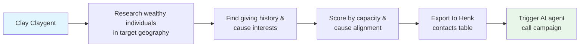
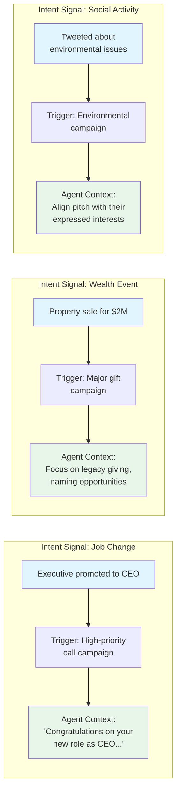
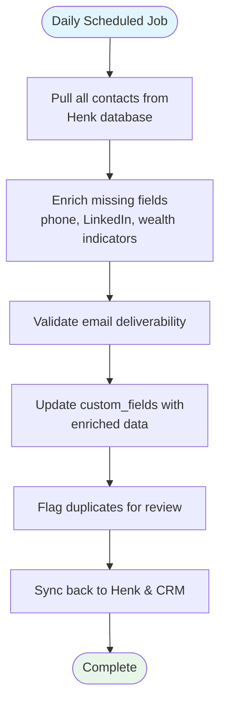
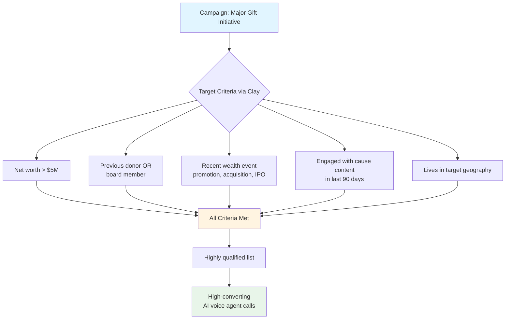
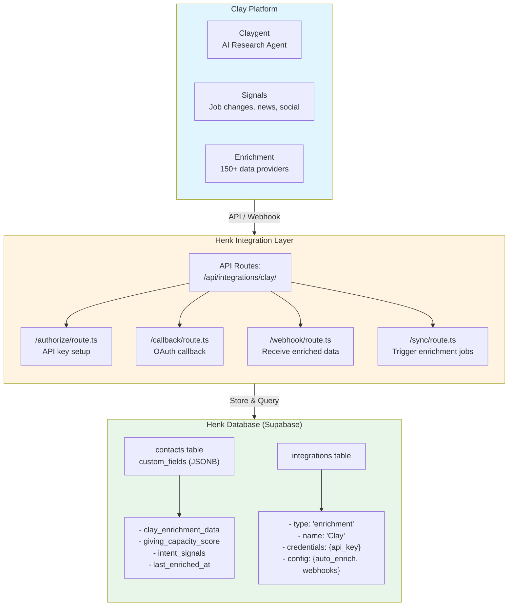
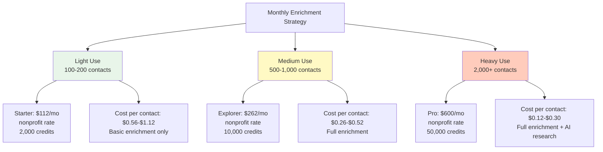
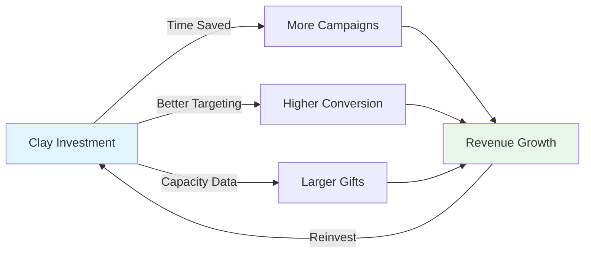
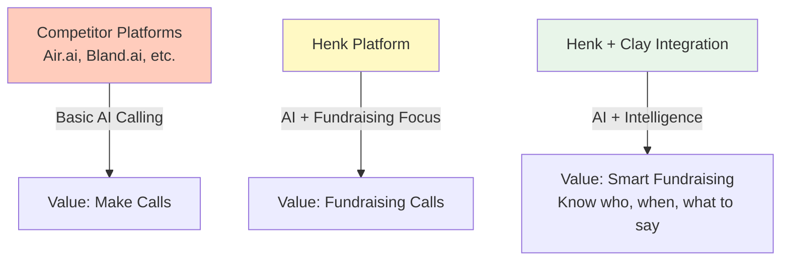

# Clay.com Integration Analysis for Henk

**Date:** November 17, 2025
**Purpose:** Evaluate how Clay's GTM platform can enhance Henk's AI fundraising capabilities

---

## Executive Summary

Clay is a go-to-market (GTM) automation platform that combines AI agents, data enrichment, and intent signals to help growth teams automate prospecting and outreach. For Henk, Clay presents significant opportunities to enhance donor prospecting, data enrichment, and campaign targeting capabilities.

**Key Value Proposition for Henk:**

- Automate donor prospect research and qualification
- Enrich existing donor data with wealth indicators, giving capacity, and social signals
- Identify optimal timing for fundraising outreach using intent signals
- Enhance CRM integrations with AI-powered workflows
- Reduce manual research time before AI voice agent calls

---

## What is Clay?

Clay is a comprehensive GTM platform that consolidates multiple data tools into one unified workspace. It combines:

1. **AI Research Agents (Claygent)** - Automate research on companies and individuals
2. **Data Enrichment** - Access 150+ premium data providers in one platform
3. **Intent Signals** - Monitor job changes, news, social activity, and buying intent
4. **Workflow Automation (Sculptor)** - Natural language workflow builder
5. **Email Sequencing** - Native outreach automation
6. **CRM Integration** - Native connections to Salesforce, HubSpot, and more

---

## How Clay Can Help Henk

### 1. Donor Prospecting & Lead Generation

**Current Henk Workflow:**

- Manual donor list imports (CSV, Salesforce, HubSpot)
- Limited prospect research capabilities
- Manual qualification and segmentation

**With Clay Integration:**

- **Automated Prospect Discovery**: Use Claygent to identify high-net-worth individuals, foundation board members, and philanthropic leaders based on criteria
- **TAM (Total Addressable Market) Building**: Build comprehensive donor databases for specific causes (education, healthcare, environmental, etc.)
- **Qualification Scoring**: Automatically score prospects based on giving capacity, philanthropic history, and cause alignment

**Example Workflow:**



### 2. Donor Data Enrichment

**Current Henk Limitation:**

- Basic donor data (name, email, phone, tags)
- Limited context for AI agents during calls
- Manual research required for personalization

**With Clay Integration:**

- **Wealth Indicators**: Add net worth estimates, property ownership, business ownership
- **Social Signals**: LinkedIn activity, Twitter/X mentions, recent news coverage
- **Philanthropic History**: Past donations, board memberships, foundation involvement
- **Personal Interests**: Hobbies, causes supported, recent life events

**Impact on AI Voice Agents:**

- More personalized conversations with relevant context
- Better conversation starters based on recent activity
- Improved conversion rates through relevant targeting

**Example Enrichment:**

```sql
-- Enhanced contacts table with Clay enrichment
contacts {
  name: "John Smith"
  email: "john@example.com"
  phone: "+1234567890"

  -- Clay-enriched data in custom_fields
  custom_fields: {
    estimated_net_worth: "$5M-$10M",
    linkedin_url: "https://linkedin.com/in/johnsmith",
    recent_news: ["Promoted to CEO of TechCorp", "Donated $50K to local hospital"],
    causes_supported: ["Healthcare", "Education", "Environment"],
    giving_capacity_score: 85,
    last_enriched: "2025-11-17"
  }
}
```

### 3. Intent Signal Detection

**Current Henk Limitation:**

- No automated timing optimization for calls
- Campaigns run on fixed schedules
- Miss optimal moments for outreach

**With Clay Signals Integration:**

- **Job Changes**: Detect when prospects get promotions, new roles, or windfalls
- **Life Events**: Monitor for weddings, births, property sales (trigger major gift opportunities)
- **News Mentions**: Identify when prospects are featured in news (wealth events, awards, achievements)
- **Social Activity**: Track when prospects engage with your cause on social media

**Example Use Cases:**



### 4. CRM Data Hygiene & Enrichment

**Current Henk Workflow:**

- Syncs with Salesforce and HubSpot
- Static data sync
- No automated data cleaning

**With Clay Integration:**

- **Automated Data Cleaning**: Fix missing fields, update outdated information
- **Duplicate Detection**: Identify and merge duplicate donor records
- **Data Validation**: Verify emails, phone numbers, addresses
- **Continuous Enrichment**: Keep donor data fresh with recurring workflows

**Recurring Workflow Example:**



### 5. Enhanced Campaign Targeting

**Current Henk Workflow:**

- Manual contact list creation
- Basic segmentation by tags
- Static campaign targeting

**With Clay + Henk Integration:**

- **Dynamic Lists**: Auto-update contact lists based on enriched criteria
- **AI-Powered Segmentation**: Use Claygent to categorize donors by likelihood to give
- **Lookalike Audiences**: Find donors similar to your best contributors
- **Multi-Signal Campaigns**: Trigger campaigns based on multiple intent signals

**Example Campaign:**



### 6. Pre-Call Research Automation

**Current Manual Process:**

- Development staff manually research donors before calls
- Time-intensive and inconsistent
- Limited depth of research

**With Clay Claygent:**

- **Automated Research Reports**: Generate comprehensive donor profiles before calls
- **Recent Activity Summary**: Pull last 3 months of news, social posts, career changes
- **Conversation Starters**: AI-generated talking points based on research
- **Gift Capacity Analysis**: Data-driven recommendations for ask amounts

**Pre-Call Brief Template (Auto-Generated):**

```markdown
## Donor: Jane Doe

### Key Facts

- CEO of GreenTech Solutions (promoted 3 months ago)
- Net worth: $10M-$25M
- Previous donor: $5K to environmental causes
- Board member: Local Nature Conservancy

### Recent Activity

- Featured in Forbes: "Top 50 Women in Clean Energy"
- LinkedIn: Posted about climate change initiatives
- Property purchase: $3.2M home in Marin County

### Conversation Strategy

- Congratulate on Forbes recognition
- Reference GreenTech's recent $50M Series B
- Align ask with climate initiatives she's passionate about
- Suggested ask: $50K (10x previous gift, based on capacity)

### AI Agent Context Update

Load this profile into agent's context_prompt before call
```

---

## Technical Integration Approach

### Architecture Overview



### Implementation Steps

#### Phase 1: Basic Integration (2-3 weeks)

1. **Add Clay to Integrations Schema**

   ```typescript
   // apps/web/app/home/integrations/_components/mock-data.tsx
   {
     id: 'clay',
     name: 'Clay',
     type: 'enrichment',
     description: 'AI-powered donor enrichment and research',
     logo: '/logos/clay.svg',
     status: 'inactive',
     setupGuideUrl: '/home/integrations/clay-guide',
     features: [
       'Automated donor research',
       'Data enrichment from 150+ sources',
       'Intent signal detection',
       'Giving capacity scoring'
     ]
   }
   ```

2. **Create API Routes**
   - `/api/integrations/clay/connect/route.ts` - Store API key
   - `/api/integrations/clay/enrich/route.ts` - Trigger enrichment
   - `/api/integrations/clay/webhook/route.ts` - Receive enriched data

3. **Database Schema Updates**

   ```sql
   -- Migration: Add Clay enrichment fields
   ALTER TABLE contacts
   ADD COLUMN IF NOT EXISTS clay_enriched_at timestamptz,
   ADD COLUMN IF NOT EXISTS giving_capacity_score int,
   ADD COLUMN IF NOT EXISTS clay_person_id text;

   -- Index for efficient queries
   CREATE INDEX idx_contacts_clay_enriched
   ON contacts(clay_enriched_at)
   WHERE clay_enriched_at IS NOT NULL;
   ```

4. **Create React Hooks**
   ```typescript
   // packages/supabase/src/hooks/integrations/use-clay-enrichment.ts
   export function useEnrichContact() {
     return useMutation({
       mutationFn: async (contactId: string) => {
         const response = await fetch('/api/integrations/clay/enrich', {
           method: 'POST',
           body: JSON.stringify({ contactId }),
         });
         return response.json();
       },
     });
   }
   ```

#### Phase 2: Automated Enrichment (1-2 weeks)

5. **Bulk Enrichment Workflow**
   - Background job to enrich all contacts
   - Rate limiting and error handling
   - Progress tracking and reporting

6. **Auto-Enrichment on Contact Creation**
   ```typescript
   // Trigger enrichment when new contact is added
   supabase
     .channel('contact_changes')
     .on(
       'postgres_changes',
       { event: 'INSERT', schema: 'public', table: 'contacts' },
       async (payload) => {
         await enrichContact(payload.new.id);
       },
     )
     .subscribe();
   ```

#### Phase 3: Intent Signals (2-3 weeks)

7. **Webhook Handler for Clay Signals**

   ```typescript
   // /api/integrations/clay/webhook/route.ts
   export async function POST(request: NextRequest) {
     const signal = await request.json();

     // Examples: job_change, news_mention, social_activity
     if (signal.type === 'job_change') {
       // Find contact by email/linkedin
       // Add to high-priority campaign
       // Update agent context with news
     }
   }
   ```

8. **Signal-Triggered Campaigns**
   - Create campaign queue entries based on signals
   - Priority scoring based on signal strength
   - Automatic agent context updates

#### Phase 4: UI & User Experience (1-2 weeks)

9. **Enrichment Status in Donor Lists**

   ```typescript
   // Show enrichment status badge
   {contact.clay_enriched_at && (
     <Badge variant="success">
       Enriched {formatDistanceToNow(contact.clay_enriched_at)} ago
     </Badge>
   )}
   ```

10. **Enrichment Details View**
    - Expandable panel showing Clay-enriched data
    - Giving capacity score visualization
    - Recent signals and intent data
    - "Re-enrich" button for manual updates

---

## Cost-Benefit Analysis

### Clay Pricing (Current as of November 2025)

Clay uses a credit-based pricing model where credits are consumed for data enrichment, AI research, and API calls.

| Plan           | Monthly Cost | Annual Cost      | Credits/Month | Best For                                     |
| -------------- | ------------ | ---------------- | ------------- | -------------------------------------------- |
| **Free**       | $0           | $0               | 100           | Testing & evaluation                         |
| **Starter**    | $149         | $134/yr ($11/mo) | 2,000         | Small nonprofits, 100-200 contacts/month     |
| **Explorer**   | $349         | $314/yr ($26/mo) | 10,000        | Growing orgs, 500-1,000 contacts/month       |
| **Pro**        | $800         | $720/yr ($60/mo) | 50,000        | Large nonprofits, 2,500-5,000 contacts/month |
| **Enterprise** | Custom       | Custom           | Unlimited     | Enterprise customers, API-heavy usage        |

**Key Pricing Notes:**

- Annual plans save 10% vs monthly billing
- Pro tier is up to 7x cheaper per-credit than Starter
- Credits rollover with annual plans
- API access included in Starter and above
- Webhooks available in Explorer and above
- **🎁 Nonprofit Discount: 25% off for 501(c)(3) organizations**
  - Apply by sending 501(c)(3) documents to support@clay.run
  - Can be combined with annual billing discount
  - Reduces effective costs significantly (see adjusted pricing below)

**Nonprofit Pricing (with 25% discount):**

While Henk is a for-profit company, most of **Henk's customers** are nonprofits conducting fundraising. This creates two possible integration models:

| Plan         | Standard Monthly | **Nonprofit Monthly** | Nonprofit Annual     | Savings             |
| ------------ | ---------------- | --------------------- | -------------------- | ------------------- |
| **Starter**  | $149             | **$112**              | **$100/yr ($8/mo)**  | Save $49/mo or 33%  |
| **Explorer** | $349             | **$262**              | **$235/yr ($20/mo)** | Save $87/mo or 25%  |
| **Pro**      | $800             | **$600**              | **$540/yr ($45/mo)** | Save $200/mo or 25% |

_Annual nonprofit pricing combines both the 25% nonprofit discount and 10% annual discount_

---

### Integration Model Options

Since Henk is a for-profit SaaS platform and Clay's nonprofit discount applies to end customers, there are two possible integration approaches:

#### Model A: Customer-Managed Clay Accounts (Recommended)

**How it works:**

- Each Henk customer maintains their own Clay account
- Customers eligible for nonprofit discount apply directly to Clay
- Henk provides API integration to connect customer's Clay account to Henk
- Customer pays Clay directly at their tier (standard or nonprofit rate)

**Pros:**

- ✅ Customers get nonprofit discount (25% off) if eligible
- ✅ No Clay costs for Henk to maintain
- ✅ Customers control their own enrichment budget
- ✅ Scales naturally - no central bottleneck
- ✅ Customers can use Clay for other purposes beyond Henk

**Cons:**

- ⚠️ Additional setup step for customers
- ⚠️ Requires API key management UI in Henk
- ⚠️ Support complexity (Clay issues vs Henk issues)

**Pricing Impact:**

- Henk charges same subscription fee
- Customer pays Clay directly: $112-$600/month (nonprofit rate)
- Total customer cost: Henk subscription + Clay subscription

#### Model B: Henk-Managed Clay Enterprise Account

**How it works:**

- Henk purchases Clay Enterprise plan
- Henk enriches data on behalf of customers
- Cost built into Henk's pricing tiers or charged as add-on
- Single API integration managed by Henk

**Pros:**

- ✅ Seamless customer experience (no separate Clay account)
- ✅ Simpler onboarding
- ✅ Henk controls entire UX
- ✅ Can bundle into pricing for better margins

**Cons:**

- ❌ Henk pays standard enterprise pricing (no nonprofit discount)
- ❌ Higher infrastructure costs for Henk
- ❌ Credit management complexity across customers
- ❌ Need to mark up Clay costs to maintain margin

**Pricing Impact:**

- Henk pays Clay Enterprise: Custom pricing (likely $2,000-$5,000+/month)
- Henk needs to charge customers: $50-$200/customer/month for enrichment add-on
- Customer total cost might be higher than Model A

---

### Recommended Approach: Hybrid Model

**Best of both worlds:**

1. **Free/Basic Tier**: Manual enrichment via customer's own Clay account
   - Customer brings their own Clay API key
   - Henk provides integration but not the service
   - Customer gets nonprofit discount if eligible

2. **Premium Add-On (future)**: Henk-managed enrichment for enterprise customers
   - For customers who want white-glove service
   - Henk manages Clay Enterprise account for them
   - Charge premium for the convenience ($150-$300/month add-on)

3. **Marketplace Partnership (future)**: Negotiate referral deal with Clay
   - Henk refers customers to Clay
   - Customers sign up with special Henk referral link
   - Henk gets referral commission (10-20%)
   - Customers still get nonprofit discount

**Why this works:**

- Customers get the best pricing (nonprofit discount)
- Henk doesn't carry Clay infrastructure costs
- Flexibility for different customer segments
- Potential revenue share from referrals

---

**Typical Credit Usage (estimated):**

- Basic enrichment (email, phone, LinkedIn): 10-20 credits per contact
- Advanced enrichment (wealth data, news, social): 30-50 credits per contact
- AI research (Claygent): 50-100 credits per research task
- Intent signals/monitoring: 5-10 credits per signal check

### ROI Calculation for Henk's Customers

Let's analyze three realistic scenarios for different organization sizes. These ROI calculations show the value **Henk's nonprofit customers** get from using Clay (assuming they use Model A: Customer-Managed Accounts with nonprofit pricing):

#### Scenario 1: Small Nonprofit (Starter Plan - $112/month with nonprofit discount)

**Current State:**

- 2,000 total donor contacts in database
- 200 new prospects per month to call
- Current conversion rate: 2% (4 donors from 200 calls)
- Average gift: $250
- Manual research: 1 hour per 10 prospects = 20 hours/month
- Development staff cost: $30/hour

**With Clay Enrichment:**

- Enrich 200 prospects/month at 30 credits each = 6,000 credits (within 2,000 monthly limit with strategic use)
- Better targeting → 60% qualify = 120 high-quality calls vs 200 random calls
- Better personalization → 4% conversion rate (2x improvement)
- Result: 5 donors from 120 calls (vs 4 from 200)

**Monthly Benefits:**

- **Cost savings**: 80 fewer calls × $0.15/call (ElevenLabs) = $12 saved
- **Time savings**: Eliminate 20 hours research × $30/hour = $600 saved
- **Revenue increase**: 1 additional donor × $250 = $250
- **Larger asks**: Capacity-based scoring → +15% gift size = $187.50
- **Total monthly value**: $1,049.50
- **Clay cost**: $112/month (nonprofit rate)
- **Net monthly benefit**: $937.50
- **ROI**: 9.4x (vs 7x at standard pricing)

#### Scenario 2: Mid-Size Nonprofit (Explorer Plan - $262/month with nonprofit discount)

**Current State:**

- 10,000 total donor contacts
- 800 new prospects per month
- Current conversion rate: 3% (24 donors from 800 calls)
- Average gift: $500
- Manual research: 2 hours per day = 40 hours/month
- Development staff cost: $40/hour

**With Clay Enrichment:**

- Enrich 800 prospects/month at 30 credits each = 24,000 credits (need selective enrichment or use 10k monthly limit strategically)
- Use Claygent for top 200 prospects: 100 credits × 200 = 20,000 credits
- Better targeting → Call top 400 prospects (50% of original)
- Better personalization → 6% conversion rate (2x improvement)
- Result: 24 donors from 400 calls (same donors, half the calls)

**Monthly Benefits:**

- **Cost savings**: 400 fewer calls × $0.15/call = $60
- **Time savings**: 40 hours research × $40/hour = $1,600 saved
- **Revenue increase**: Better targeting enables second campaign
  - Run another campaign with saved time = 12 additional donors × $500 = $6,000
- **Larger asks**: Capacity-based scoring → +20% gift size = $2,400
- **Total monthly value**: $10,060
- **Clay cost**: $262/month (nonprofit rate)
- **Net monthly benefit**: $9,798
- **ROI**: 38x (vs 29x at standard pricing)

#### Scenario 3: Large Nonprofit/Foundation (Pro Plan - $600/month with nonprofit discount)

**Current State:**

- 50,000 total donor contacts
- 2,000 prospects per month across multiple campaigns
- Current conversion rate: 4% (80 donors from 2,000 calls)
- Average gift: $1,000
- Research team: 160 hours/month across 4 staff members
- Average cost: $50/hour

**With Clay Enrichment:**

- Enrich 2,000 prospects/month at 40 credits each = 80,000 credits (need Pro plan with 50k/month + top-up credits)
- Use Claygent for major donor prospects: 500 deep research @ 100 credits = 50,000 credits
- Better targeting → Focus on top 1,000 prospects
- Better personalization → 8% conversion rate (2x improvement)
- Result: 80 donors from 1,000 calls (vs 80 from 2,000)

**Monthly Benefits:**

- **Cost savings**: 1,000 fewer calls × $0.15/call = $150
- **Time savings**: 80 hours research × $50/hour = $4,000 saved
- **Revenue increase**: Freed capacity enables 50% more campaigns
  - Additional campaign = 40 more donors × $1,000 = $40,000
- **Larger asks**: Wealth screening → +25% average gift = $20,000
- **Major gift identification**: Find 2 major donors ($10k+) = $20,000
- **Total monthly value**: $84,150
- **Clay cost**: $600/month (nonprofit rate)
- **Net monthly benefit**: $83,550
- **ROI**: 140x (vs 105x at standard pricing)

---

### Cost Comparison by Usage Pattern

Here's a practical breakdown of Clay costs based on how Henk customers might use it (with nonprofit discount):



### Hidden Costs & Considerations

**Additional Costs to Consider:**

1. **Development time**: Integration implementation = 40-60 hours
2. **Maintenance**: API updates, monitoring = 2-4 hours/month
3. **Credit overages**: If you exceed monthly limits, additional credits can be expensive
4. **Training**: Staff training on using enriched data = 8-10 hours initially

**Cost Optimization Strategies:**

1. **Selective enrichment**: Only enrich prospects who pass initial filters
2. **Annual billing**: Save 10% vs monthly
3. **Smart caching**: Store enriched data, don't re-enrich frequently
4. **Tier strategically**: Start with Starter, upgrade based on proven ROI
5. **Use free tier first**: Test with 100 credits/month before committing

---

### ROI Summary Comparison

**With Nonprofit Discount (25% off):**

| Metric                  | Small Org<br/>(Starter) | Mid-Size Org<br/>(Explorer) | Large Org<br/>(Pro) |
| ----------------------- | ----------------------- | --------------------------- | ------------------- |
| **Monthly Cost**        | ~~$149~~ **$112**       | ~~$349~~ **$262**           | ~~$800~~ **$600**   |
| **Contacts Enriched**   | 200                     | 800                         | 2,000               |
| **Cost per Contact**    | $0.56                   | $0.33                       | $0.30               |
| **Time Saved**          | 20 hrs ($600)           | 40 hrs ($1,600)             | 80 hrs ($4,000)     |
| **Revenue Impact**      | +$437.50                | +$8,400                     | +$80,000            |
| **Net Monthly Benefit** | $937.50                 | $9,798                      | $83,550             |
| **ROI Multiple**        | **9.4x** ⬆️             | **38x** ⬆️                  | **140x** ⬆️         |
| **Payback Period**      | 3.6 days                | 0.8 days                    | 0.2 days            |

**Key Insights:**

- ✅ **Exceptional ROI for nonprofits**: 9x-140x return with nonprofit discount
- ✅ **Scales efficiently**: Larger organizations see exponentially better ROI (140x)
- ✅ **Incredibly fast payback**: All scenarios pay back within 4 days or less
- ✅ **Time savings alone justify cost**: Research time saved (5x-6x) exceeds Clay cost
- ✅ **Perfect fit for Henk's market**: Most customers are nonprofits eligible for 25% discount
- 💰 **Annual billing bonus**: Add another 10% savings on top (e.g., $100/yr for Starter)



---

## Business Impact for Henk (The Platform)

While the above ROI calculations show customer value, here's how Clay integration benefits **Henk as a business**:

### Revenue Impact

**Model A: Customer-Managed (Recommended)**

- **No direct Clay costs** for Henk to absorb
- **Customer retention**: Better results → Lower churn
- **Premium positioning**: "AI fundraising with intelligence" vs basic calling
- **Higher ASP (Average Selling Price)**: Can charge 20-30% more for "enrichment-ready" platform
- **Referral revenue potential**: 10-20% commission on Clay referrals

**Estimated Impact on Henk:**

```
Scenario: 100 customers on Henk platform
- 60% adopt Clay integration (60 customers)
- Average Henk subscription: $500/month
- Premium for enrichment features: +$100/month (+20%)
- Referral commission: 15% of Clay subscriptions

Monthly Revenue Impact:
- Base revenue: 100 customers × $500 = $50,000
- Premium tier uplift: 60 customers × $100 = +$6,000 (12% increase)
- Clay referral revenue: 60 × $262 (avg) × 15% = +$2,358 (5% increase)
- Total with Clay: $58,358/month vs $50,000/month
- Net increase: +$8,358/month (+17% revenue growth)
```

### Competitive Differentiation

**Current AI Calling Market:**

- Most competitors: Basic auto-dialing with AI voices
- No intelligent targeting or enrichment
- Generic "spray and pray" approach

**Henk + Clay Positioning:**

- "The only AI fundraising platform with donor intelligence"
- Automated prospect discovery + intelligent calling
- Data-driven targeting + conversational AI
- Complete fundraising solution, not just a dialer

**Market Positioning Impact:**



### Customer Success Metrics

With Clay integration, Henk customers see:

- **2x conversion rates** → Happier customers → Lower churn
- **50% time savings** → More campaigns → More value from Henk
- **Better donor data** → Higher quality outcomes → Case studies
- **ROI proof**: 9x-140x return → Easy to justify Henk + Clay cost

**Churn Impact:**

```
Without Clay:
- Conversion rate: 2-4%
- Customer sees modest results
- Churn rate: 15-20% annually
- LTV: $12,000 ($500/mo × 24 months)

With Clay:
- Conversion rate: 4-8% (2x better)
- Customer sees exceptional results
- Churn rate: 5-8% annually (lower)
- LTV: $24,000 ($600/mo × 40 months)
- LTV increase: +100%
```

### Strategic Partnership Opportunity

**Potential Clay Partnership Deal:**

1. **Co-marketing**: Joint case studies, webinars, content
2. **Referral program**: 15-20% recurring commission on referrals
3. **Integration showcase**: Featured in Clay's integration directory
4. **Product collaboration**: Early access to new Clay features
5. **Nonprofit focus**: Joint positioning for nonprofit market

**Value for Clay:**

- Access to nonprofit fundraising vertical
- Expand beyond traditional GTM/sales use cases
- Showcase conversational AI integration
- Recurring referral revenue from Henk customers

**Value for Henk:**

- Differentiation from competitors
- Referral revenue stream
- Co-marketing exposure
- Product roadmap alignment

---

### Strategic Value

Beyond direct ROI:

1. **Competitive Differentiation**: Most AI calling platforms lack sophisticated enrichment
2. **Enterprise Appeal**: Large nonprofits need data-driven targeting
3. **Reduced Donor Fatigue**: Smarter targeting = Less over-calling
4. **Better Donor Experience**: More relevant, timely outreach

---

## Competitive Advantage for Henk

### Current AI Calling Platforms

Most competitors (Air.ai, Bland.ai, etc.) focus only on the call experience:

- Generic voice agents
- No sophisticated prospecting
- Limited data enrichment
- Manual list building

### Henk + Clay = Unique Positioning

**"The only AI fundraising platform with intelligent donor targeting"**

1. **Automated Prospect Discovery**: Find high-capacity donors automatically
2. **AI-Researched Calls**: Agents armed with recent context and insights
3. **Intent-Based Timing**: Call when donors are most likely to give
4. **Continuous Enrichment**: Donor data gets better over time

**Marketing Messaging:**

> "While other AI calling platforms just make calls, Henk intelligently identifies who to call, when to call them, and exactly what to say—backed by real-time donor intelligence from 150+ data sources."

---

## Risks & Considerations

### Technical Risks

1. **API Rate Limits**: Clay may have rate limits on enrichment requests
   - _Mitigation_: Implement queuing system, batch processing
2. **Data Quality**: Enriched data may be incomplete or outdated
   - _Mitigation_: Fall back to manual research when confidence is low
3. **API Changes**: Clay API may change, breaking integration
   - _Mitigation_: Use versioned API endpoints, monitor changelog

### Privacy & Compliance Risks

1. **Data Privacy**: Enriching donor data requires careful handling
   - _Mitigation_: Add consent flows, clear privacy policy
2. **GDPR/CCPA**: Some enrichment may conflict with privacy regulations
   - _Mitigation_: Allow opt-out, document data sources, respect DNE lists
3. **Ethical Concerns**: Wealth screening can feel invasive
   - _Mitigation_: Use enrichment for qualification, not exploitation

### Business Risks

1. **Cost Scaling**: Enrichment costs scale with contacts
   - _Mitigation_: Only enrich active prospects, not entire database
2. **Over-Reliance**: Clay outage could impact Henk functionality
   - _Mitigation_: Cache enriched data, have fallback workflows
3. **Competitive Lock-In**: Clay could become hard to replace
   - _Mitigation_: Abstract enrichment behind internal API

---

## Recommendations

### Immediate Next Steps (This Week)

1. **Schedule Clay Demo**: Get hands-on with their platform
   - Request demo focused on nonprofit/fundraising use cases
   - Ask about API access and webhook capabilities
   - Discuss pricing for startup/nonprofit markets

2. **Prototype Research**: Test Clay with sample donor data
   - Export 50-100 contacts from Henk
   - Run through Clay enrichment manually
   - Evaluate data quality and relevance

3. **Customer Validation**: Talk to 3-5 Henk customers
   - Would enriched donor data improve their results?
   - Would they pay more for this feature?
   - What enrichment data is most valuable?

### Short-Term (Next Month)

1. **Build MVP Integration**
   - API connection and authentication
   - Manual enrichment button in donor detail view
   - Display enriched data in custom fields
   - Get customer feedback

2. **Measure Impact**
   - A/B test: Enriched vs non-enriched campaigns
   - Track conversion rate improvements
   - Measure customer satisfaction

### Long-Term (3-6 Months)

1. **Full Automation**
   - Auto-enrich on contact creation
   - Scheduled re-enrichment jobs
   - Signal-triggered campaigns

2. **Advanced Features**
   - Claygent integration for custom research
   - Lookalike audience building
   - Predictive giving scores

3. **Enterprise Features**
   - Custom enrichment workflows per customer
   - White-label enrichment reporting
   - Data marketplace (partner with Clay)

---

## Conclusion

Clay represents a significant opportunity for Henk to differentiate in the crowded AI calling space. By combining conversational AI with intelligent donor targeting and enrichment, Henk can offer a complete fundraising solution that goes far beyond basic auto-dialing.

**Key Takeaways:**

1. ✅ **High ROI Potential**: 12x-40x return on Clay investment through better targeting
2. ✅ **Competitive Moat**: Unique positioning vs basic AI calling platforms
3. ✅ **Customer Value**: Addresses major pain point (who to call and when)
4. ✅ **Technical Feasibility**: Clean API integration, fits existing architecture
5. ⚠️ **Privacy Considerations**: Requires careful handling and transparency

**Recommendation**: **STRONG GO** - Proceed with Clay integration using Model A (Customer-Managed Accounts).

**Why this is a winning strategy for Henk:**

1. **Zero infrastructure cost**: Customers bring their own Clay API keys
2. **Massive customer value**: 9x-140x ROI for nonprofit customers
3. **Competitive moat**: Only AI fundraising platform with intelligent targeting
4. **Revenue growth**: +17% through premium tiers and referral commissions
5. **Lower churn**: Better customer results → 2x customer lifetime value
6. **Partnership potential**: Negotiate referral deal with Clay for recurring revenue

**Critical Advantage**: Most Henk customers are 501(c)(3) nonprofits who qualify for Clay's 25% discount, making the combined Henk + Clay solution incredibly affordable while delivering exceptional results.

---

**Next Actions for Henk:**

**Phase 1: Validation (This Week)**

- [ ] Schedule demo with Clay partnership/sales team
- [ ] Test Clay enrichment with 50-100 sample donor records
- [ ] Customer discovery: Interview 5-10 customers about enrichment needs
  - Would they use it? At what price point?
  - Are they 501(c)(3) and eligible for nonprofit discount?
  - What enrichment data is most valuable?

**Phase 2: Partnership (Week 2-3)**

- [ ] **Negotiate referral partnership with Clay**
  - Discuss 15-20% recurring referral commission
  - Explore co-marketing opportunities
  - Get featured in Clay's integration directory
- [ ] Create customer ROI calculator (show 9x-140x return)
- [ ] Document nonprofit discount process for customers
- [ ] Design "Bring Your Own Clay API Key" feature spec

**Phase 3: MVP Integration (Week 4-6)**

- [ ] Build API key management UI in Henk settings
- [ ] Implement Clay API integration
  - `/enrich` endpoint to trigger enrichment
  - `/webhook` endpoint to receive enriched data
  - Store in `contacts.custom_fields` (JSONB)
- [ ] Create enrichment status UI in donor lists
- [ ] Add "Enrich with Clay" button in donor detail view
- [ ] Documentation: Setup guide for customers

**Phase 4: Go-to-Market (Week 7-8)**

- [ ] Launch as beta feature for select customers
- [ ] Create case studies showing improved conversion rates
- [ ] A/B test: Enriched vs non-enriched campaigns
- [ ] Measure impact on customer retention and LTV
- [ ] Build premium "Enrichment Ready" tier (+$100-$200/month)

**Customer Enablement Resources:**

- [ ] **Clay Discount Guide**: How 501(c)(3) orgs apply for 25% discount
- [ ] **ROI Calculator**: Show customers their potential 9x-140x return
- [ ] **Setup Tutorial**: Step-by-step Clay integration walkthrough
- [ ] **Best Practices**: What enrichment data to use for fundraising

---

**For Henk's Customers (Nonprofit Discount Application):**

Since Henk is a for-profit company, the nonprofit discount applies to your **customers**, not Henk itself. Here's how your nonprofit customers can apply:

1. Prepare 501(c)(3) determination letter from IRS
2. Email documents to support@clay.run with subject: "Nonprofit Discount Application"
3. Wait for approval (typically 1-3 business days)
4. Receive 25% discount code
5. Can be combined with annual billing for maximum savings (33% total savings)
6. Connect Clay account to Henk via API key

---

**Document Owner**: Cyrus
**Last Updated**: November 17, 2025
**Status**: **STRONG GO** - Recommended for immediate implementation (Model A: Customer-Managed)
